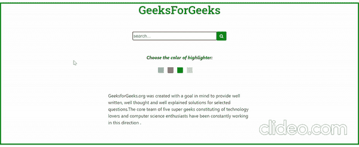

# 如何用 JavaScript 突出显示搜索到的字符串结果？

> 原文:[https://www . geesforgeks . org/如何使用 javascript 突出显示搜索到的字符串结果/](https://www.geeksforgeeks.org/how-to-highlight-the-searched-string-result-using-javascript/)

下面给出的是一个 HTML 文档，基本上是关于如何突出显示搜索到的字符串结果。在本文中，我们使用了 HTML、CSS、JavaScript、Bootstrap 和 mark.js 来使我们的网站更加有效。此外，专门用于在给定的上下文或段落中突出显示搜索到的字符串，mark.js 在这个特定的代码中起着至关重要的作用。在处理这个问题之前，请记住我的话，这个问题可以通过许多其他方法来解决，但我认为这也可能是解决这个问题的更好方法。

**什么是 mark.js？**

mark.js 是一个简单的 JavaScript 工具，用于突出显示文本。用于动态标记搜索词或自定义正则表达式，并提供一些内置选项，如音调符号支持、单独的单词搜索等。

**进场:**

*   首先，当您在搜索框中输入一些字符串并按下搜索按钮时，一个名为 highlight()的简单 JavaScript 函数将调用，其主要作用是突出显示您在搜索框中输入的搜索文本。在这个小程序中，我们将使用 mark.js 代码来突出显示文本。
*   mark.js 中有很多内置函数，但是我们的需求使用了两个函数，分别是 mark()和 unmark()函数。这里，标记()用于突出显示搜索文本，取消标记()用于取消突出显示之前突出显示的文本。

**标记()的语法:**

```html
var context = document.querySelector(".context");
var obj = new Mark(context);
obj.mark(searchkeyword [, options]);
```

*   让我们从技术角度来理解这段代码，
    *   首先，我们声明一个包含上下文的变量，它将从中查找并突出显示搜索到的文本。
    *   创建一个标记对象，然后通过之前创建的 obj 调用 mark()方法。
    *   它带有两个参数，即一个是搜索关键字，另一个是可选的。

**解组()的语法:**

```html
var context = document.querySelector(".context");
var obj = new Mark(context);
obj.unmark(options);
```

*   这几乎与上述技术相同，但唯一的细微差别是 unmark()方法只带一个参数，即可选参数。此外，如果您想更改荧光笔的颜色和填充，那么我们需要对标记内部的 CSS 代码进行细微的更改，如下所示:

    ```html
    mark {
        color: black;
        background: green;
        padding: 5px;
    }
    ```

*   希望您已经成功地完成了上述步骤，以便对特定突出显示文本的颜色进行更改。但是在这里，请确保不应该有任何字符串以任何特定的颜色突出显示，如果是这样，那么不要忘记取消突出显示之前搜索的文本。然后，标记要搜索的新字符串，您可以根据自己的方便更改其颜色。
*   更多信息请关注[本页](https://markjs.io/)。

**示例:**

## 超文本标记语言

```html
<!DOCTYPE html>
<html>

<head>
    <meta name="viewport" content=
        "width=device-width, initial-scale=1.0">

    <!-- CDN of fontawsome -->
    <link rel="stylesheet" href=
"https://cdnjs.cloudflare.com/ajax/libs/font-awesome/4.7.0/css/font-awesome.min.css">

    <!-- CDN of Bootstrap -->
    <link rel="stylesheet" href=
"https://maxcdn.bootstrapcdn.com/bootstrap/4.0.0-alpha.6/css/bootstrap.min.css"
        integrity=
"sha384-rwoIResjU2yc3z8GV/NPeZWAv56rSmLldC3R/AZzGRnGxQQKnKkoFVhFQhNUwEyJ" 
        crossorigin="anonymous">

    <!-- CDN of mark.js -->
    <script src="https://cdnjs.cloudflare.com/ajax/libs/mark.js/8.11.1/mark.min.js"
        integrity=
"sha512-5CYOlHXGh6QpOFA/TeTylKLWfB3ftPsde7AnmhuitiTX4K5SqCLBeKro6sPS8ilsz1Q4NRx3v8Ko2IBiszzdww=="
        crossorigin="anonymous">
    </script>

    <!-- CDN of google font -->
    <style>
        @import url('https://fonts.googleapis.com/css2?family=Roboto+Slab:wght@500&display=swap'
        );
    </style>

    <style>
        mark.a0 {
            color: black;
            padding: 5px;
            background: greenyellow;
        }

        mark.a1 {
            color: black;
            padding: 5px;
            background: cyan;
        }

        mark.a2 {
            color: black;
            padding: 5px;
            background: red;
        }

        mark.a3 {
            color: white;
            padding: 5px;
            background: green;
        }

        mark.a4 {
            color: black;
            padding: 5px;
            background: pink;
        }
    </style>
</head>

<body style="border:4px solid rgb(0, 128, 28);">
    <h1 style="font-family: 'Roboto Slab', 
        serif;text-align: center;color:green;">
        GeeksForGeeks
    </h1>
    <br><br>

    <form>
        <div class="container-fluid" align="center">
            <input type="text" size="30" 
                placeholder="search..." id="searched"
                style="border: 1px solid green; 
                        width:300px;height:30px;">

            <button type="button" class="btn-primary btn-sm"
                style="margin-left:-5px;height:32px;width:35px;
                        background-color:rgb(12, 138, 12);
                        border:0px;" onclick="highlight('0');">

                <i class="fa fa-search"></i>
            </button>
        </div>
    </form>
    <br><br>

    <div align="center">
        <div>
            <b><i>Choose the color of highlighter:</i></b>
        </div>
        <br>
        <div style="background-color: cyan; 
            width: 20px; height: 20px;
            display: inline-block; margin-left: -30px;" 
            onmouseover="highlight('1')">
        </div>

        <div style="background-color: red; 
            width: 20px; height: 20px; 
            display: inline-block; margin-left: 10px;"
            onmouseover="highlight('2')">
        </div>

        <div style="background-color: green; 
            width: 20px; height: 20px;
            display: inline-block; margin-left: 10px;" 
            onmouseover="highlight('3')">
        </div>

        <div style="background-color: pink; 
            width: 20px; height: 20px;
            display: inline-block; margin-left: 10px;" 
            onmouseover="highlight('4')">
        </div>
    </div>

    <div class="container-fluid" style=
        "padding-left: 30%; padding-right: 30%;
        padding-top: 5%;">

        <p class="select">
            GeeksforGeeks.org was created with a
            goal in mind to provide well written, 
            well thought and well explained solutions
            for selected questions.The core team of 
            five super geeks constituting of technology 
            lovers and computer science enthusiasts
            have been constantly working in this 
            direction.
        </p>
    </div>

    <script>
        function highlight(param) {

            // Select the whole paragraph
            var ob = new Mark(document.querySelector(".select"));

            // First unmark the highlighted word or letter
            ob.unmark();

            // Highlight letter or word
            ob.mark(
                document.getElementById("searched").value,
                { className: 'a' + param }
            );
        }
    </script>
</body>

</html>
```

**输出:**

