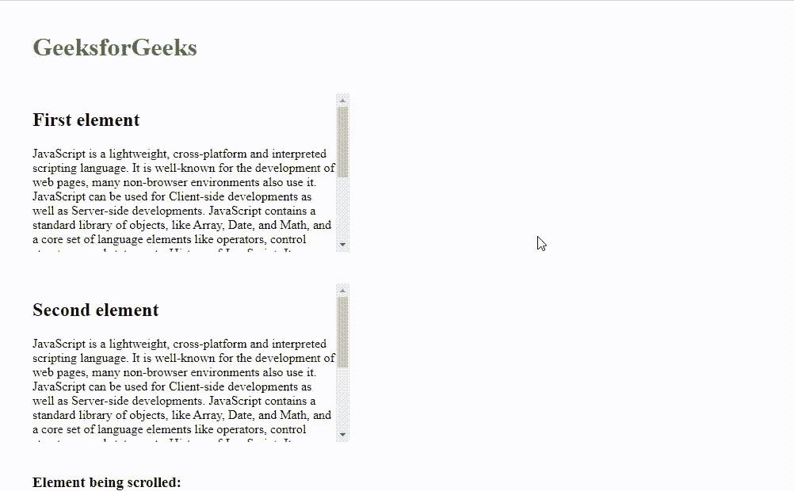

# 如何使用 JavaScript 识别正在使用哪个元素滚动？

> 原文:[https://www . geeksforgeeks . org/如何使用 javascript 识别哪个元素正在被滚动使用/](https://www.geeksforgeeks.org/how-to-identify-which-element-scroll-is-being-used-using-javascript/)

给定 DOM 中的许多元素，任务是找出当前使用 JavaScript 滚动的元素。

**方法:**这个问题用 JavaScript 很容易解决。我们将把“滚动”事件监听器添加到所有必需的元素中。每当滚动特定元素时，就会触发滚动事件。因此，我们可以很容易地在它的帮助下找到哪个元素正在滚动。

**示例:**在本例中，我们创建了两个可滚动元素，并为它们都添加了“滚动”事件侦听器。只要滚动任何元素，该特定元素的滚动事件就会触发。

## 超文本标记语言

```
<!DOCTYPE html>
<html lang="en">
  <head>
    <meta charset="UTF-8" />
    <meta name="viewport" 
          content="width=device-width, initial-scale=1.0" />
    <title>How to identify which element
      scroll is being used using JavaScript?</title>

    <style>
      h1 {
        color: #2f8d46;
        font-weight: bold;
        margin: 40px;
      }

      #first {
        height: 200px;
        width: 400px;
        overflow-y: scroll;
        margin: 40px;
      }

      #second {
        margin: 40px;
        height: 200px;
        width: 400px;
        overflow-y: scroll;
      }

      #scrolled {
        margin: 40px;
      }
    </style>
  </head>
  <body>
    <h1>GeeksforGeeks</h1>

    <!--First element-->
    <div id="first">
      <h2>First element</h2>

<p>
        JavaScript is a lightweight, cross-platform 
        and interpreted scripting language. It is well-known 
        for the development of web pages, many non-browser 
        environments also use it. JavaScript can be used for 
        Client-side developments as well as Server-side
        developments. JavaScript contains a standard library 
        of objects, like Array, Date, and Math, and a core
        set of language elements like operators, control
        structures, and statements.
        History of JavaScript: It was created in 1995
        by Brendan Eich while he was an engineer at Netscape.
        It was originally going to be named LiveScript but
        was renamed. Unlike most programming languages, 
        the JavaScript language has no concept of input
        or output. It is designed to run as a scripting 
        language in a host environment, and it is up to 
        the host environment to provide mechanisms for 
        communicating with the outside world. The most 
        common host environment is the browser.
      </p>

    </div>

    <!--Second element-->
    <div id="second">
      <h2>Second element</h2>

<p>
        JavaScript is a lightweight, cross-platform 
        and interpreted scripting language. It is well-known 
        for the development of web pages, many non-browser 
        environments also use it. JavaScript can be used for 
        Client-side developments as well as Server-side
        developments. JavaScript contains a standard library 
        of objects, like Array, Date, and Math, and a core
        set of language elements like operators, control
        structures, and statements.
        History of JavaScript: It was created in 1995
        by Brendan Eich while he was an engineer at Netscape.
        It was originally going to be named LiveScript but
        was renamed. Unlike most programming languages, 
        the JavaScript language has no concept of input
        or output. It is designed to run as a scripting 
        language in a host environment, and it is up to 
        the host environment to provide mechanisms for 
        communicating with the outside world. The most 
        common host environment is the browser.
      </p>

    </div>

    <div id="scrolled">
      <h3>Element being scrolled: <span id="result"></span></h3>
    </div>

    <script>

      <!--Selecting required elements from the DOM-->
      const first = document.querySelector("#first");
      const second = document.querySelector("#second");
      const result = document.querySelector("#result");

      <!--Adding the scroll event listener-->
      first.addEventListener("scroll", () => (result.textContent = "First"));
      second.addEventListener("scroll", () => (result.textContent = "Second"));
    </script>
  </body>
</html>
```

**输出:**

