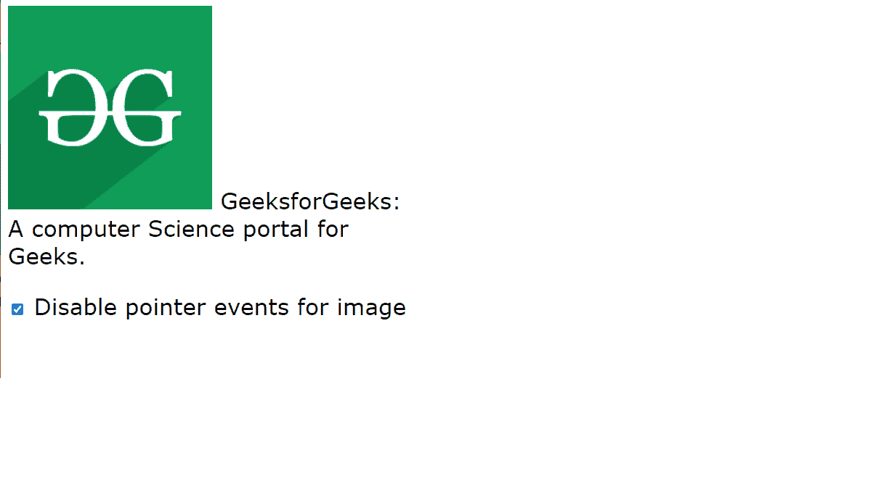
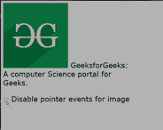

# 如何用 JavaScript 忽略叠加图像上的鼠标交互？

> 原文:[https://www . geesforgeks . org/如何忽略鼠标-叠加-交互-图像-使用-javascript/](https://www.geeksforgeeks.org/how-to-ignore-mouse-interaction-on-overlay-image-using-javascript/)

忽略叠加图像上的鼠标交互可以由 CSS 属性控制，即*指针事件*。
它是一个属性，定义页面的某个元素是否会对指针事件做出反应。

**语法:**

```html
pointer-events: auto\none;
```

**示例:**以下示例演示了指针事件属性的使用。

```html
<!DOCTYPE html>
<html>

<head>
  <title>CSS pointer events</title>

  <style>
    .main {
      position: relative;
      width: 450px;
      font: 25px Verdana;
    }

    .overlay {
      position: absolute;
      left: 0px;
      top: 0;
      width: 225px;
      height: 225px;
    }

    .pointer-events-none {
      pointer-events: none;
    }
  </style>

  <script>
    window.onload = function () {
      document.getElementById(
        "enable-disable-pointer-events")
        .onclick = function () {
          document.getElementById("overlay")
            .className = "overlay " 
            + ((this.checked) ? 
            "pointer-events-none" : "");
      };
    };
  </script>
</head>

<body>
  <div class="main">
    <a href="https://www.geeksforgeeks.org/">
      </a>
    GeeksforGeeks: A computer 
    Science portal for Geeks.

    <div id="overlay" class="overlay"></div>

    <p>
      <input id="enable-disable-pointer-events" 
          type="checkbox">
      <label for="enable-disable-pointer-events">
        Disable pointer events for image
      </label>
    </p>
  </div>
</body>

</html>
```

**输出:**
**当复选框未被选中时:**

**当复选框被选中时:**


**最终输出:**
