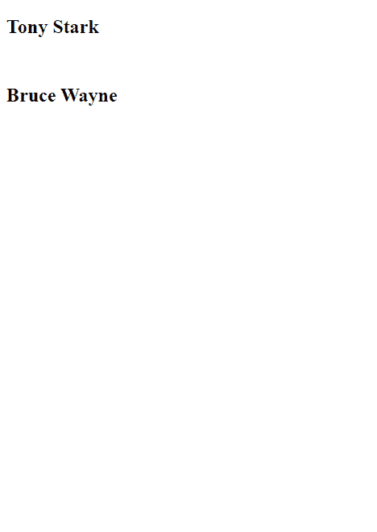

# 如何在 JavaScript 中实现对象的过滤器()？

> 原文:[https://www . geesforgeks . org/如何在 javascript 中实现对象过滤器/](https://www.geeksforgeeks.org/how-to-implement-a-filter-for-objects-in-javascript/)

filter()方法基本输出通过特定测试或满足特定功能的所有元素**对象**。filter()方法的返回类型是由满足指定函数的所有元素/对象组成的数组。

**语法:**

```
var newArray = arr.filter(callback(object[, ind[, array]])[, Arg])
```

**参数:**

*   **回调**是一个谓词，用来测试数组的每个对象。返回“真”保留对象，否则返回“假”。它包含三个参数:
*   **对象:**数组中正在处理的当前对象。
*   ind(可选):数组中正在处理的当前对象的索引。
*   数组(可选):调用过滤器的数组。
*   参数(可选):要使用的值(。这)时执行回调。

**例 1:**

```
<script>
    var array = 
        [-1, -4, 5, 6, 8, 9, -12, -5, 4, -1];
    var new_array = 
        array.filter(element => element >= 0);
    document.write(
      "<h2>Output\n</h2>", "<h3>", new_array, "</h3>");
</script>
```

**输出:**

以上示例返回给定数组中的所有正元素。

**例 2:**

```
<script>
var employees = [
    {name: "Tony Stark", department: "IT"},
    {name: "Peter Parker", department: "Pizza Delivery"},
    {name: "Bruce Wayne", department: "IT"},
    {name: "Clark Kent", department: "Editing"}
];

var output =  employees.filter(employee => employee.department == "IT");
for(var i=0;i<output.length;i++){
   document.write("<h2>", output[i].name, "</h2>", "<br/>")
};
</script>
```

**输出:**
