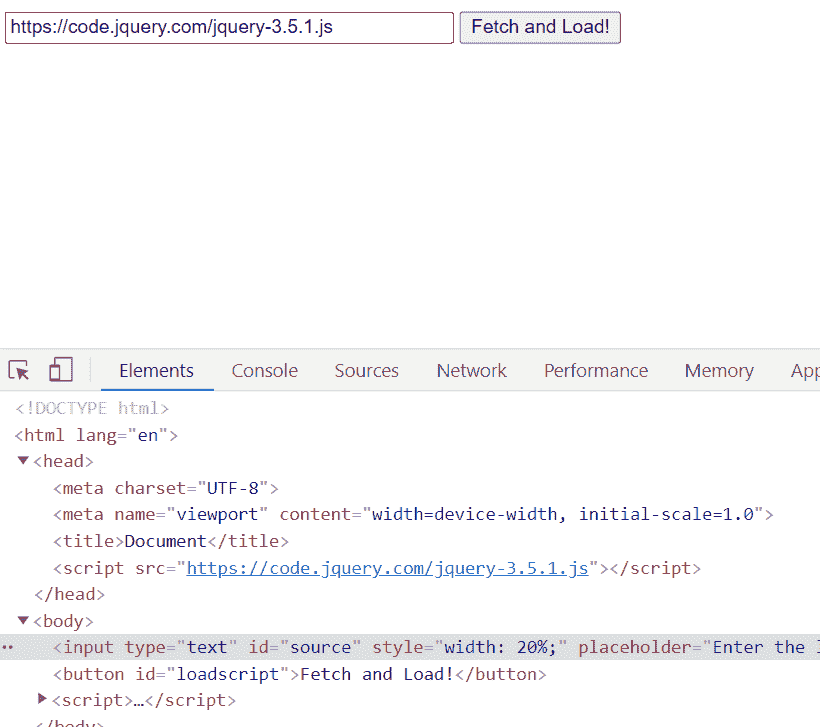
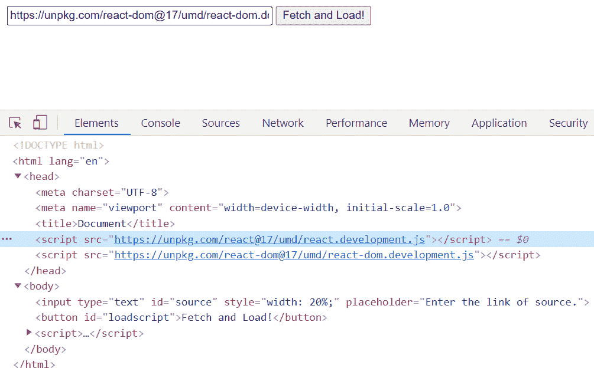
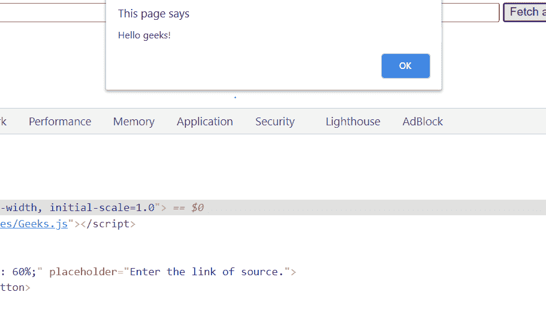

# 如何实现在浏览器中获取/执行一个 JavaScript 文件的函数“getScript”？

> 原文:[https://www . geesforgeks . org/如何在浏览器中实现函数获取执行 javascript 文件/](https://www.geeksforgeeks.org/how-to-implement-a-function-getscript-that-fetches-executes-a-javascript-file-in-browser/)

在本文中，我们将学习如何获取一个 JavaScript 文件(。js)，并通过使用带有 HTML 的 JavaScript 将其动态加载到 web 浏览器中。我们需要一个网页浏览器，即铬(推荐)或电子应用。有时我们需要根据用户界面的要求在文档中添加一个脚本，这在缺省页面加载中是做不到的。

本文是关于从文档对象模型中的任何 jQuery (CDN)链接或 React 文件中获取一个 JS 文件。

**进场:**

1.  创建新的脚本元素。

    ```
    let newscript = document.createElement('script');
    ```

2.  为新创建的脚本元素提供源代码。

    ```
    newscript.src = document.getElementById("source").value;
    ```

3.  在 DOM 头中添加元素，以便它可以执行脚本。

    ```
     document.head.appendChild(newscript)
    ```

在下面的示例中，通过将以下文件资源视为动态加载的脚本示例，实现了上述方法。

**资源:**可以使用输入字段中的这个 CDn 链接来获取。

*   **JQuery CDN:**

    ```
     https://code.jquery.com/jquery-3.5.1.js 
    ```

*   **反应 CDN :**

    ```
    https://unpkg.com/react@17/umd/react.development.js
    https://unpkg.com/react-dom@17/umd/react-dom.development.js
    ```

*   **自定义脚本:**

    ```
    https://graphicalstructure.codes/Geeks.js
    ```

**注意:**我们将使用这些文件。(用户可以根据自己的要求使用任何来源)。

**示例:**

## 超文本标记语言

```
<!DOCTYPE html>
<html lang="en">

<head>
    <meta charset="UTF-8" />
    <meta name="viewport" content=
        "width=device-width, initial-scale=1.0" />
</head>

<body>
    <input type="text" id="source" style="width: 60%" 
        placeholder="Enter the link of source." />

    <button id="loadscript">Fetch and Load!</button>

    <script>
        document.getElementById("loadscript")
        .onclick = function getScript() {

            let newscript = 
                document.createElement("script");

            newscript.src = document
                .getElementById("source").value;

            document.head.appendChild(newscript);
        };
    </script>
</body>

</html>
```

**输出:**下面的输出显示了 JavaScript 文件的动态加载。

*   **jQuery CDN:**
    
*   **动态加载 ReactJS:** <be></be>
*   **加载自定义 JS :**
    

**备注:**

*   用户可以使用元素上的任何事件来加载脚本。在这篇文章中。
    [“onclick”](https://www.geeksforgeeks.org/html-dom-onclick-event/)事件已被使用。
*   脚本不应包含错误，否则它们可能引发错误，并可能导致代码执行立即停止。
*   使用适当的错误处理，以便在提取时发生任何错误时，代码的执行不会中断。
*   上述实现也适用于电子 JS。