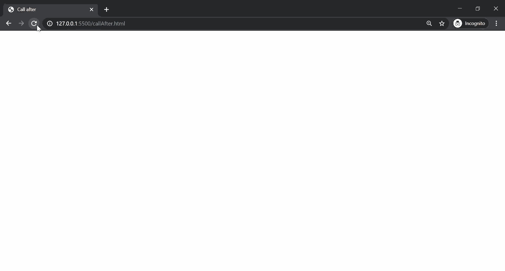

# 如何用 JavaScript 实现一个函数在指定时间后启用另一个函数？

> 原文:[https://www . geeksforgeeks . org/如何使用 javascript 实现指定时间后启用另一个函数的函数/](https://www.geeksforgeeks.org/how-to-implement-a-function-that-enable-another-function-after-specified-time-using-javascript/)

让我们假设给了我们一个函数 **add()** ，该函数接受两个参数 **a** 和 **b** 、**T7】并返回它们的和。我们应该实现一个函数，该函数应该能够在给定的**延迟**时间后调用任何函数。这可以通过下面给出的方法来实现:**

**方法 1:** 创建一个函数，该函数考虑延迟量、要调用的函数和要给出的参数。

在这种方法中，我们将把 **add()** 函数及其参数传递给我们已经创建的**的 **callAfter()** 。**在给定的**延迟**时间后， [setTimeout()](https://www.geeksforgeeks.org/java-script-settimeout-setinterval-method/) 方法用于从 callAfter()方法内部调用 add()函数。参数也被传递给函数。

**示例:**

## 超文本标记语言

```
<!DOCTYPE html>
<html>

<body>
    <script>
        function callAfter(delay, myFunct,
            ...params) {
            setTimeout(() => {
                myFunct(...params);
            }, delay);
        }

        function add(a, b) {
            alert("The sum is : " + (a + b));
        }

        callAfter(2000, add, 4, 7);
    </script>
</body>

</html>
```

**方法 2:** 使用匿名函数。

在某些情况下，您可能希望传递带有参数的函数，但不希望在调用回调之前调用它。在这种情况下，您可以将其包装在匿名函数中。

**示例:**

## 超文本标记语言

```
<!DOCTYPE html>
<html>

<body>
    <script>
        function callAfter(delay, funct) {
            setTimeout(() => {
                funct();
            }, delay);
        }

        function add(a, b) {
            alert("The sum is : " + (a + b));
        }

        callAfter(2000, function() {
            add(4, 7);
        });
    </script>
</body>

</html>
```

**方法 3:** **在 JavaScript 中使用原型:**在这种方法中，我们可以向函数构造器的原型对象添加一个方法。这将允许我们使用任何功能的 **callAfter()** 。

**语法:**

```
functionName.callAfter(delay, param1, param2, ....);
```

**示例:**

## 超文本标记语言

```
<!DOCTYPE html>
<html>

<head>
    <title>Call after</title>
</head>

<body>
    <script>
        Function.prototype.callAfter =
            function(delay, ...params) {
                setTimeout(() => this(...params), delay);
            };

        function add(a, b) {
            alert("The sum is : " + (a + b));
        }

        add.callAfter(2000, 4, 7);
    </script>
</body>

</html>
```

**输出:**在上述所有接近的指定延迟后，显示一条警告信息。

