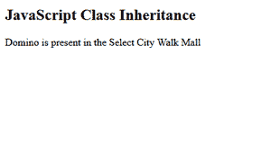

# 如何在 ES6 中实现继承？

> 原文:[https://www . geeksforgeeks . org/如何在 es6 中实现继承/](https://www.geeksforgeeks.org/how-to-implement-inheritance-in-es6/)

在本文中，我们将了解如何在 es6 中实现继承。 **ES6** JavaScript 支持面向对象的编程组件，如对象、类和方法。此外，在类中，我们可以实现继承，使子类继承父类的所有方法。这可以使用**扩展**和**超级**关键词来完成。

我们使用**扩展** **关键字**来实现 ES6 中的继承。要扩展的类称为基类或父类。扩展基类或父类的类称为派生类或子类。构造函数中的 **super()** **方法**用于访问派生类使用的所有父类的属性和方法。

下面的例子将演示*扩展*和*超级*关键词的使用。

**示例:**让我们创建一个 Shop 类，它将继承父“Mall”类的方法。

## 超文本标记语言

```
<!DOCTYPE html>
<html>
<body>
    <h2>JavaScript Class Inheritance</h2>
    <p id="demo"></p>

    <script>
        class Mall {
            constructor(shopname) {
                this.shopname = shopname;
            }
            shopispresent() {
                return this.shopname + 
                  ' is present in the  ';
            }
        }

        class Shop extends Mall {
            constructor(name, mallname) {
                super(name);
                this.mallname = mallname;
            }
            showshop() {
                return this.shopispresent() +
                  this.mallname;
            }
        }

        let newMall = new Shop(
          "Domino", "Select City Walk Mall"
        );
        document.getElementById("demo")
                .innerHTML = newMall.showshop();
    </script>
</body>
</html>
```

**输出:**



**说明:**

*   在上例中， **super** 关键字作为**“函数”**调用父类**商城**，参数传递给**店铺。**这是为了确保**店铺**是**商城**的一个实例而要执行的关键步骤。
*   另一方面，**扩展**关键字用于将**店铺**设置为**商城的子类或子类。**要将某个类设置为其他类的子类，必须使用 extends。