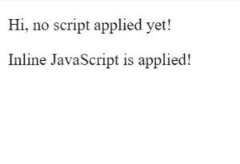
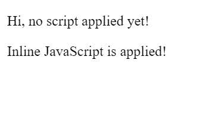
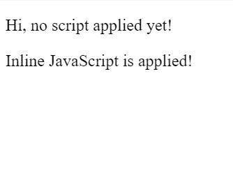

# 如何在 HAML 包含内联 JavaScript？

> 原文:[https://www . geesforgeks . org/how-include-inline-JavaScript-in-haml/](https://www.geeksforgeeks.org/how-to-include-inline-javascript-in-haml/)

在 HTML 中包含 JavaScript 主要有两种方式:

*   内部/内联:通过在“头”或“体”部分使用“脚本”元素。
*   外部:通过使用外部 JavaScript 文件。

我们将为 HTML 扩展下面的例子，并看看如何为 HAML 实现类似的功能。为了在 HTML 中包含内联 JavaScript，在“head”或“body”部分使用了“Script”元素，该元素在开始和结束标记之间包含 JavaScript 代码。

考虑下面一个 HTML 文件的例子，其中我们使用 JavaScript 在“正文”部分使用内联 JavaScript 将新的“p”元素插入到“div”中。

```html
<!DOCTYPE html>
<html>

<head>
    <title>HTML inline JavaScript demo</title>
</head>

<body>
    <div id="container">
        <p>Hi, no script applied yet!</p>
    </div>

    <script type="text/javascript">
        var tag = document.createElement("p");
        var text = document.createTextNode(
                "Inline JavaScript is applied!");

        tag.appendChild(text);
        var element = document.getElementById("container");
        element.appendChild(tag);  
    </script>
</body>

</html>
```

**输出:**


在 HAML，可以使用`:javascript`代替“脚本”标签。注意压痕，因为 HAML 对压痕很敏感。

```html
:javascript
    // JavaScript code goes here with proper indentation

```

因此，在 HAML，同样的初始 HTML 示例变成了:

```html
%html 
    %head 
        %title Basic Haml Template

    %body
        %div#container
            %p Hi, no script applied yet!

        :javascript
            var tag = document.createElement("p");
            var text = document.createTextNode(
            "Inline JavaScript is applied!");
            tag.appendChild(text);
            var element = document.getElementById("container");
            element.appendChild(tag);  
```

**输出:**


将内联 JavaScript 包含到 HAML 的另一种方式是使用`%script{type: "text/javascript"}`

```html
%script{type: "text/javascript"}
    // JavaScript code goes here with proper indentation

```

当您想要使用不同于`text/javascript`的类型时，此格式非常有用。
在 HAML 最初的例子中使用了这种方法来包含内联 JavaScript:

```html
%html 
    %head 
        %title Basic Haml Template

    %body
        %div#container
            %p Hi, no script applied yet!

        %script{type: "text/javascript"}
            var tag = document.createElement("p");
            var text = document.createTextNode(
            "Inline JavaScript is applied!");
            tag.appendChild(text);
            var element = document.getElementById("container");
            element.appendChild(tag);  
```

**输出:**


**参考:**[http://haml.info/docs/yardoc/file.参考. html # JavaScript-过滤器](http://haml.info/docs/yardoc/file.REFERENCE.html#javascript-filter)