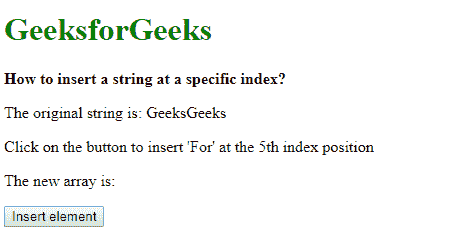
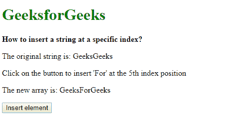

# 如何在 JavaScript 中的特定索引处插入字符串？

> 原文:[https://www . geesforgeks . org/如何在 javascript 中插入特定于字符串的索引/](https://www.geeksforgeeks.org/how-to-insert-a-string-at-a-specific-index-in-javascript/)

给定一个包含单词的字符串，任务是在给定的索引处插入一个新的字符串。有两种方法可以解决这个问题，讨论如下:

**方法 1:使用 slice()方法:**首先通过在必须插入新字符串的地方将其拆分，将字符串分成两部分。**切片()**方法用于返回两个索引之间的数组。它需要两个参数，一个是指定的开始索引，另一个是结束索引。
提取字符串的第一部分，使用起始位置作为 0，使用结束位置作为新字符串必须插入的索引。字符串的第二部分是使用起始位置作为新字符串必须插入的索引提取的。结束位置在这里是可选的，它将被假定直到字符串的结尾。新字符串通过简单的字符串连接添加到这两部分之间。

**示例:**

```
<!DOCTYPE html>
<html>

<head>
    <title>
        How to insert a string
        at a specific index?
    </title>
</head>

<body>
    <h1 style="color: green">
        GeeksforGeeks
    </h1>

    <b>
        How to insert a string
        at a specific index?
    </b>

    <p>The original string is: GeeksGeeks</p>

    <p>
        Click on the button to insert
        'For' at the 5th index position
    </p>

    <p>
        The new array is: 
        <span class="outputString"></span>
    </p>

    <button onclick="insertString()">
        Insert element
    </button>

    <script type="text/javascript">

        function insertString() {
            let origString = "GeeksGeeks";
            let stringToAdd = "For";
            let indexPosition = 5;

            newString = origString.slice(0, indexPosition)
                    + stringToAdd
                    + origString.slice(indexPosition);

            document.querySelector('.outputString').textContent
                    = newString;
        }
    </script>
</body>

</html>
```

**输出:**

*   **点击按钮前:**
    
*   **点击按钮后:**
    

**方法二:使用拼接()方法:**使用**分割()**方法在分隔符的基础上分割字符串。此方法可用于通过指定空白分隔符将字符串拆分为单个字母。此步骤用于将字符串转换为数组，因为下一步需要它。
使用**拼接()**方法在特定索引处插入或替换数组内容。这可用于在数组位置插入新字符串。它需要 3 个参数，即要插入字符串的索引、要执行的删除次数(如果有)和要插入的字符串。
所需的索引和字符串作为参数传递给此方法，删除参数设置为 0。它将字符串插入数组。使用 **join()** 方法将数组连接回来。这使它再次成为一个完整的字符串，新字符串连接在两者之间。

**示例:**

```
<!DOCTYPE html>
<html>

<head>
    <title>
        How to insert a string
        at a specific index?
    </title>
</head>

<body>
    <h1 style="color: green">
        GeeksforGeeks
    </h1>

    <b>
        How to insert a string
        at a specific index?
    </b>

    <p>
        The original string
        is: GeeksGeeks
    </p>

    <p>
        Click on the button to insert
        'For' at the 5th index position
    </p>

    <p>
        The new array is: 
        <span class="outputString"></span>
    </p>

    <button onclick="insertString()">
        Insert element
    </button>

    <script type="text/javascript">

        function insertString() {
            let origString = "GeeksGeeks";
            let stringToAdd = "For";
            let indexPosition = 5;

            // Split the string into individual
            // characters
            origString = origString.split('');

            // Insert the string at the index position
            origString.splice(indexPosition, 0, stringToAdd);

            // Join back the individual characters
            // to form a new string
            newString = origString.join('');

            document.querySelector('.outputString').textContent
                        = newString;
        }
    </script>
</body>

</html>
```

**输出:**

*   **点击按钮前:**
    
*   **点击按钮后:**
    