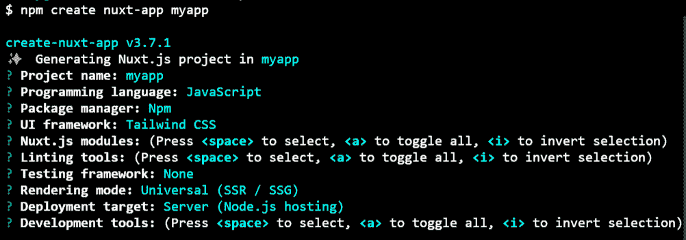
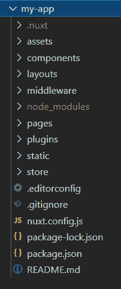
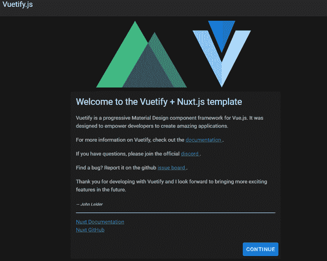

# 如何安装和创建第一个 Nuxt.js App？

> 原文:[https://www . geesforgeks . org/how-first-nuxt-js-app/](https://www.geeksforgeeks.org/how-to-install-and-creating-first-nuxt-js-app/)

**什么是 NuxtJS？**

NuxtJS 是一个用于创建网络应用的 VueJS 框架。它使开发更加快速、容易和有组织。NuxtJS 类似于 Next.js，是 React.js 的一个框架。

**NuxtJS 的主要特点是:**

*   **超棒的文件夹结构:** Nuxt App 自带超棒的文件夹结构，让开发变得快速且有条理。
*   **服务器端渲染(SSR):** 在向客户端发送 HTML 之前，在服务器端轻松渲染反应组件。
*   **静态渲染:**文件或文件夹创建时自动生成路线。
*   **代码拆分:**使用特殊的 Webpack 配置创建 web 应用的静态版本。

**先决条件:**以下是创建 Nuxt 应用程序的一些先决条件。

*   已安装节点(版本 10.13 或更高版本)。
*   NPM 基础知识(节点包经理)。

**创建和运行 nuxt 应用程序的步骤:**

**步骤 1:** 现在在桌面上为您的项目创建一个文件夹，并通过您的终端导航到该文件夹。

**第二步:**在终端运行以下命令。*我的应用*是我们应用的名字，你可以选择任何名字。

```
npx create-nuxt-app my-app
```

**第三步:**之后，你要在终端回答一些问题，根据你的选择回答那些问题。



**步骤 4:** 现在使用以下命令导航到您的应用程序:

```
cd my-app
```

**文件夹结构:**会是这样的。



**步骤 5:** 使用以下命令运行您的应用程序。

```
npm run dev
```

**输出:**现在打开浏览器，转到***http://localhost:3000/***，会看到如下输出:



**参考:**T2】https://nuxtjs.org/docs/2.x/get-started/installation