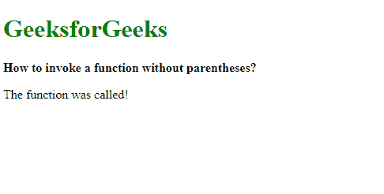

# 如何用 JavaScript 调用不带括号的函数？

> 原文:[https://www . geesforgeks . org/如何使用 javascript 调用不带括号的函数/](https://www.geeksforgeeks.org/how-to-invoke-a-function-without-parentheses-using-javascript/)

**方法 1:使用新的操作符:****新的**操作符用于创建具有构造函数的对象的实例。这个构造函数可以用来编写我们自己的函数，然后被新的操作符调用。使用该运算符时，括号是可选的，因此即使没有括号，函数也会被调用。

**语法:**

```
new exampleFunction
```

**示例:**

```
<!DOCTYPE html>
<html>
<head>
    <title>
        How to invoke a function
        without parentheses?
    </title>
</head>
<body>
    <h1 style="color: green">
        GeeksforGeeks
    </h1>
    <b>
        How to invoke a function
        without parentheses?
    </b>
    <p class="output"></p> 

    <script type="text/javascript">
        function exampleFunction() {
            document.querySelector(".output").textContent
                  = "The function was called!";
        }

        // Using the new operator
        new exampleFunction;
    </script>
</body>
</html>
```

**输出:**


**方法 2:使用标记模板文字:**标记模板文字是 JavaScript ES6 中引入的模板文字的一个用例。当使用模板文字时，它允许直接使用函数。它可以与参数一起使用，在文字中绕过它们。要调用一个函数，它的名字要和反记号(`)一起写，以表示它是标记的模板文字。

**语法:**

```
exampleFunction``
```

**示例:**

```
<!DOCTYPE html>
<html>
<head>
    <title>
        How to invoke a function
        without parentheses?
    </title>
</head>
<body>
    <h1 style="color: green">
        GeeksforGeeks
    </h1>
    <b>
        How to invoke a function
        without parentheses?
    </b>
    <p class="output"></p> 

    <script type="text/javascript">
        function exampleFunction() {
            document.querySelector(".output").textContent
                    = "The function was called!";
        }

        // Using tagged template literals
        exampleFunction``;
    </script>
</body>
</html>
```

**输出:**


**方法 3:修改 toString()方法:**每当需要进行字符串转换时，都会调用 toString()方法。可以创建一个对象，修改该对象的 toString()方法以调用所需的函数。此对象可用于通过执行与空字符串的连接来调用 toString()。它将强制调用 toString()方法，该方法又将调用指定的函数。

**语法:**

```
let tempObj = {
    toString: exampleFunction
}

'' + tempObj;
```

**示例:**

```
<!DOCTYPE html>
<html>
<head>
    <title>
        How to invoke a function
        without parentheses?
    </title>
</head>
<body>
    <h1 style="color: green">
        GeeksforGeeks
    </h1>
    <b>
        How to invoke a function
        without parentheses?
    </b>
    <p class="output"></p> 

    <script type="text/javascript">
        function exampleFunction() {
            document.querySelector(".output").textContent
                   = "The function was called!";
        }

        let tempObj = {
          toString: exampleFunction
        }

        // Forcing the modified 
        // toString function to be invoked
        '' + tempObj;
    </script>
</body>
</html>
```

**输出:**
