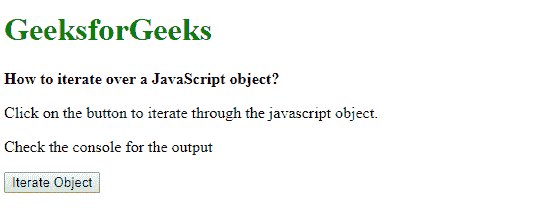
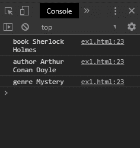

# 如何迭代一个 JavaScript 对象？

> 原文:[https://www . geesforgeks . org/如何迭代 javascript 对象/](https://www.geeksforgeeks.org/how-to-iterate-over-a-javascript-object/)

有两种方法可以迭代对象，讨论如下:

**方法 1:在循环中使用 for…可以使用 for 迭代对象的属性..循环中。此循环用于迭代对象的所有非符号可迭代属性。有些对象可能包含从其原型继承的属性。 **hasOwnProperty()** 方法可以用来检查属性是否属于对象本身。通过使用键作为对象的索引，可以找到对象的每个键的值。**

**语法:**

```
for (let key in exampleObj) {
    if (exampleObj.hasOwnProperty(key)) {
        value = exampleObj[key];
        console.log(key, value);
    }
}
```

**示例:**

```
<!DOCTYPE html>
<html>

<head>
    <title>
        How to iterate over
        a JavaScript object?
    </title>
</head>

<body>
    <h1 style="color: green">
        GeeksforGeeks
    </h1>

    <b>
        How to iterate over
        a JavaScript object? 
    </b>

    <p>
        Click on the button to iterate
        through the javascript object.
    </p>

    <p>
        Check the console
        for the output
    </p>

    <button onclick="iterateObject()">
        Iterate Object
    </button>

    <script type="text/javascript">
        function iterateObject() {
            let exampleObj = {
                book: "Sherlock Holmes",
                author: "Arthur Conan Doyle",
                genre: "Mystery"
            };

            for (let key in exampleObj) {
                if (exampleObj.hasOwnProperty(key))
                {
                    value = exampleObj[key];
                    console.log(key, value);
                }
            }
        }
    </script>
</body>

</html>
```

**输出:**

*   **点击按钮前:**
    
*   **点击按钮后:**
    

**方法 2: Object.entries()映射:****object . entries()**方法用于返回对象自己的可枚举字符串键属性对的数组。返回的数组与**映射()**方法一起使用，从对中提取键和值。
可以通过访问数组对的第一个和第二个索引来提取键值对中的键和值。第一个索引对应于密钥，第二个索引对应于密钥对的值。

**语法:**

```
Object.entries(exampleObj).map(entry => {
    let key = entry[0];
    let value = entry[1];
    console.log(key, value);
});
```

**示例:**

```
<!DOCTYPE html>
<html>

<head>
    <title>
        How to iterate over 
        a JavaScript object?
    </title>
</head>

<body>
    <h1 style="color: green">
        GeeksforGeeks
    </h1>

    <b>
        How to iterate over
        a JavaScript object? 
    </b>

    <p>
        Click on the button to iterate
        through the javascript object.
    </p>

    <p>
        Check the console
        for the output
    </p>

    <button onclick="iterateObject()">
        Iterate Object
    </button>

    <script type="text/javascript">
        function iterateObject() {
            let exampleObj = {
                book: "Sherlock Holmes",
                author: "Arthur Conan Doyle",
                genre: "Mystery"
            };

            Object.entries(exampleObj).map(entry => {
                let key = entry[0];
                let value = entry[1];
                console.log(key, value);
            });
        }
    </script>
</body>

</html>
```

**输出:**

*   **点击按钮前:**
    
*   **点击按钮后:**
    