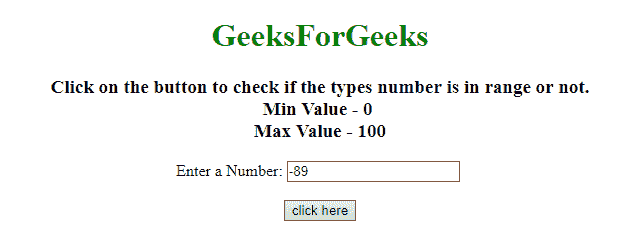
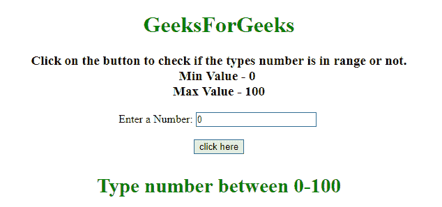
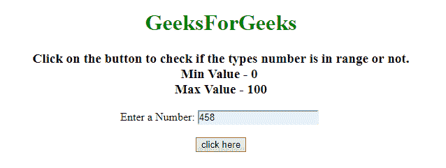
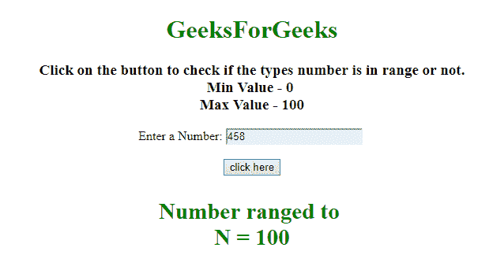

# 如何在 JavaScript 中限制一个数值在最小值/最大值之间？

> 原文:[https://www . geesforgeks . org/如何在 javascript 中限制最小-最大值之间的数字/](https://www.geeksforgeeks.org/how-to-limit-a-number-between-a-min-max-value-in-javascript/)

给定 HTML 文档。任务是，在通过输入元素从用户处获取输入数字时，验证该数字是否在指定范围内。如果不是，则将其更改为范围内。这里讨论了借助 JavaScript 的两种方法。
**进场 1:**

*   从输入元素中获取输入，并使用 **Number()方法**将其转换为数字。
*   使用 **IF-ELSE 条件**验证是否在范围内？
*   如果数字小于最小值，则给它最小值，否则如果。
*   如果这个数大于最大值，那么就给它最大值，否则这个数就在这个范围内。

**示例 1:** 该示例实现了上述方法。

```
<!DOCTYPE HTML>
<html>

<head>
    <title>
        Limit a number between a min/max value
    </title>
    <script src=
"https://ajax.googleapis.com/ajax/libs/jquery/3.4.0/jquery.min.js">
    </script>
</head>

<body style="text-align:center;">
    <h1 style="color:green;">  
            GeeksForGeeks  
        </h1>
    <p id="GFG_UP">
    </p>
    Enter a Number:
    <input id="num" />
    <br>
    <br>
    <button onclick="GFG_Fun();">
        click here
    </button>
    <p id="GFG_DOWN" style="color: green;">
    </p>
    <script>
        var up = document.getElementById('GFG_UP');
        var down = document.getElementById('GFG_DOWN');
        up.innerHTML = 
          "Click on the button to check if the types number"+
          " is in range or not.<br>Min Value - 0 <br> Max Value - 100";

        function GFG_Fun() {
            var input = document.getElementById('num');
            var n = input.value;
            n = Number(n);
            if (n < 0) {
                $('#GFG_DOWN').html('Type number between 0-100');
                input.value = 0;
            } else if (n > 100) {
                $('#GFG_DOWN').html('Type number between 0-100');
                input.value = 100;
            } else {
                $('#GFG_DOWN').html('You typed the valid Number.');
                input.value = n;
            }
        }
    </script>
</body>

</html>
```

**输出:**

*   **点击按钮前:**
    

*   **After clicking on the button:**
    

    **方法 2:**

    *   从输入元素中获取输入，并使用 **Number()方法**将其转换为数字。
    *   使用**数学最大值和数学最小值方法**验证是否在范围内？
    *   如果数字小于最小值，则给它最小值，否则如果。
    *   如果这个数大于最大值，那么就给它最大值，否则这个数就在这个范围内。

    **示例 2:** 该示例实现了上述方法。

    ```
    <!DOCTYPE HTML>
    <html>

    <head>
        <title>
            Limit a number between a min/max value
        </title>
        <script src=
    "https://ajax.googleapis.com/ajax/libs/jquery/3.4.0/jquery.min.js">
        </script>
    </head>

    <body style="text-align:center;">
        <h1 style="color:green;">  
                GeeksForGeeks  
            </h1>
        <p id="GFG_UP">
        </p>
        Enter a Number:
        <input id="num" />
        <br>
        <br>
        <button onclick="GFG_Fun();">
            click here
        </button>
        <p id="GFG_DOWN" style="color: green;">
        </p>
        <script>
            var up = document.getElementById('GFG_UP');
            var down = document.getElementById('GFG_DOWN');
            up.innerHTML = 
              "Click on the button to check if the types number "+
           "is in range or not.<br>Min Value - 0 <br> Max Value - 100";

            function GFG_Fun() {
                var input = document.getElementById('num');
                var n = input.value;
                n = Number(n);
                n = Math.min(100, Math.max(0, n));
                $('#GFG_DOWN').html('Number ranged to <br>N = ' + n);
            }
        </script>
    </body>

    </html>
    ```

    **输出:**

    *   **点击按钮前:**
        
    *   **点击按钮后:**
        