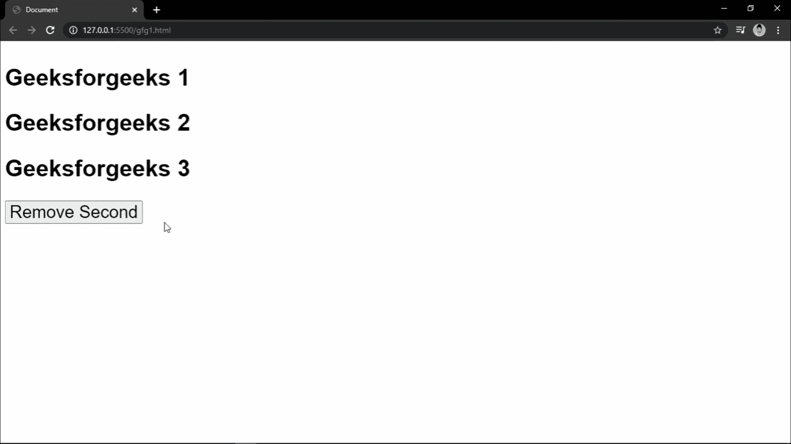

# 如何使用 CSS 和 JavaScript 线性过渡 DOM 元素的移除？

> 原文:[https://www . geesforgeks . org/如何使用 css 和 javascript 对 dom 元素的移除进行线性转换/](https://www.geeksforgeeks.org/how-to-linearly-transition-the-removal-of-a-dom-element-using-css-and-javascript/)

对于一个特定的 HTML/DOM 元素，我们的工作是移除它，并在移除过程中添加一个过渡。最终，只要点击触发按钮，DOM 元素就应该向右平移，最后从视图和 DOM 中移除。

使用 CSS 转换元素经常会让开发人员感到困惑。这个属性可以有很多变化，实际上任何 CSS 属性都可以转换，无论是不透明度还是位置。在本教程中，我们将转换文本元素的水平位置，该位置将最终被移除。

从现在开始，要移除的 DOM 元素将被称为**目标**。

**进场:**

*   三个“h2”标签和一个按钮被包装在容器部分内。第二个标签是唯一的，带有 id“section”。
*   目标有一个 id(“秒”)来转换运动。这是通过使用 CSS 中的**过渡**属性来完成的。
*   向按钮添加一个 click 事件侦听器，这将向目标添加一个类(“已移除”)，因此目标应该开始翻译。
*   在 CSS 中，id 为(“秒”)的元素的此转换设置为**转换 1s 0s** 。
*   现在，设置要删除的标题的“transform”属性，等于 **translateX(len)，这里**len 指的是元素要被翻译的长度。我们将其设置为**“100 大众”**。
*   最后，一个事件监听器被添加到监听转换结束的目标中。这将借助 JavaScript 的 **remove()** 方法移除目标。

**示例:**

## 超文本标记语言

```html
<!DOCTYPE html>
<html>

<head>
    <!-- Styling with CSS -->
    <style>

        .removed{
            transform: translateX(100vw);
        }

        #second{
            transition: transform 1s 0s;
        }

        .cntnr{
            overflow-x: hidden;
        }
    </style>
</head>

<body>
    <section class="cntnr">
        <h2>Geeksforgeeks 1</h2>
        <h2 id="second">Geeksforgeeks 2</h2>
        <h2>Geeksforgeeks 3</h2>
        <button>Remove Second</button>
    </section>

    <!-- Functionality with JavaScript -->
    <script>
        var btn = document.querySelector("button");
        var secondText = document.querySelector("#second");

        btn.addEventListener("click",() => {
            secondText.classList.add("removed");
        });

        secondText.addEventListener("transitionend",() => {
            secondText.remove();
        })
    </script>
</body>

</html>
```

**输出:**

