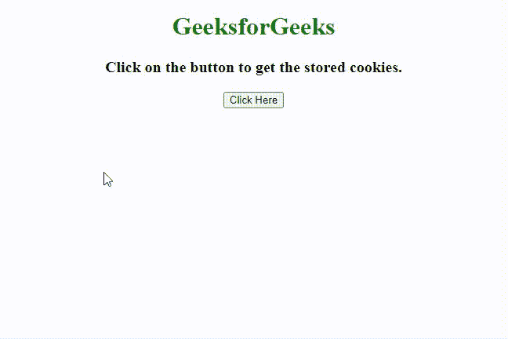
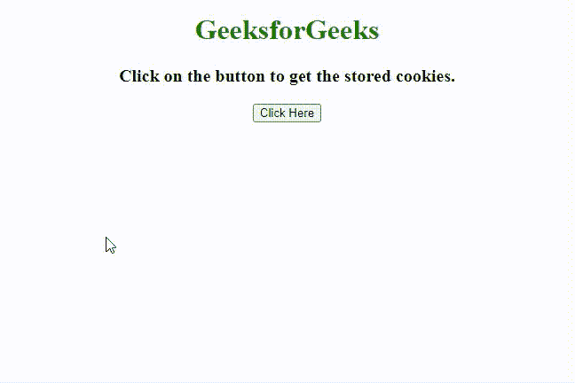

# 如何用 JavaScript 列出当前页面的所有 cookies？

> 原文:[https://www . geesforgeks . org/如何使用 javascript 列出当前页面的所有 cookie/](https://www.geeksforgeeks.org/how-to-list-all-the-cookies-of-the-current-page-using-javascript/)

在本文中，我们将知道如何用 Javascript 获取当前页面的所有 cookies 列表，并通过示例了解它们的实现。任务是检索存储在当前域中的 cookie(由于安全原因，我们无法获得所有 cookie)。有两种方法可以解决这个问题，下面讨论。

**方法 1:**

*   使用 [**文档. cookie**](https://www.geeksforgeeks.org/html-dom-cookie-property/) 访问 cookie。
*   使用**。split()方法**将它们拆分在“；”上去买一堆饼干。
*   遍历 cookies 数组。
*   将所有 cookies 一个接一个地附加到字符串中以供打印。

**示例:**该示例实现了上述方法。

## 超文本标记语言

```
<!DOCTYPE HTML>
<html>

<head>
    <title>How to list all cookies for the current page?</title>
    <script src=
"https://ajax.googleapis.com/ajax/libs/jquery/3.4.1/jquery.min.js">
    </script>
</head>

<body style="text-align:center;">
    <h1 style="color: green"> 
        GeeksforGeeks 
    </h1>
    <p id="GFG_UP" style="font-size: 20px; font-weight: bold;"> </p>

    <button onclick="gfg_Run()"> Click Here </button>
    <p id="GFG_DOWN" style="color:green;
        font-size: 26px; font-weight: bold;"> </p>

    <script>
    var el_up = document.getElementById("GFG_UP");
    var el_down = document.getElementById("GFG_DOWN");
    el_up.innerHTML = "Click on the button to " 
    + "get the stored cookies.";

    function getCookies() {
        var cookies = document.cookie.split(';');
        var ret = '';
        for(var i = 1; i <= cookies.length; i++) {
            ret += i + ' - ' + cookies[i - 1] + "<br>";
        }
        return ret;
    }

    function gfg_Run() {
        el_down.innerHTML = getCookies();
    }
    </script>
</body>

</html>
```

**输出:**



使用 Javascript 获取存储的 cookies

**方法 2:**

*   使用 [**文档. cookie**](https://www.geeksforgeeks.org/html-dom-cookie-property/) 访问 cookie。
*   使用**。split()方法**将它们拆分在“；”上去买一堆饼干。
*   使用**。reduce()方法**并逐个访问每个 cookie。
*   获取 cookie 的名称和值。对于每个饼干，使用**在“=”上分割。拆分()方法**并从 cookie 中访问**名称和值**。
*   这个方法和前面的方法一样，将 cookies 作为一个对象返回。

**示例:**该示例实现了上述方法。

## 超文本标记语言

```
<!DOCTYPE HTML>
<html>

<head>
    <title>How to list all cookies for the current page?</title>
    <script src=
"https://ajax.googleapis.com/ajax/libs/jquery/3.4.1/jquery.min.js">
    </script>
</head>

<body style="text-align:center;">
    <h1 style="color: green"> 
        GeeksforGeeks 
    </h1>
    <p id="GFG_UP" style="font-size: 20px; font-weight: bold;"> </p>

    <button onclick="gfg_Run()">Click Here</button>
    <p id="GFG_DOWN" style="color:green;
        font-size: 26px; font-weight: bold;"> </p>

    <script>
    var el_up = document.getElementById("GFG_UP");
    var el_down = document.getElementById("GFG_DOWN");
    el_up.innerHTML = "Click on the button " 
    + "to get the stored cookies.";

    function gfg_Run() {
        var cookies = document.cookie.split(';').reduce(
            (cookies, cookie) => {
                const [name, val] = cookie.split('=').map(c => c.trim());
                cookies[name] = val;
                return cookies;
            }, {});
        el_down.innerHTML = JSON.stringify(cookies);
    }
    </script>
</body>

</html>
```

**输出:**



使用 Javascript 获取存储的 cookies