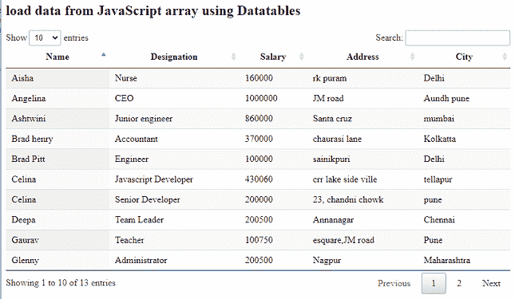
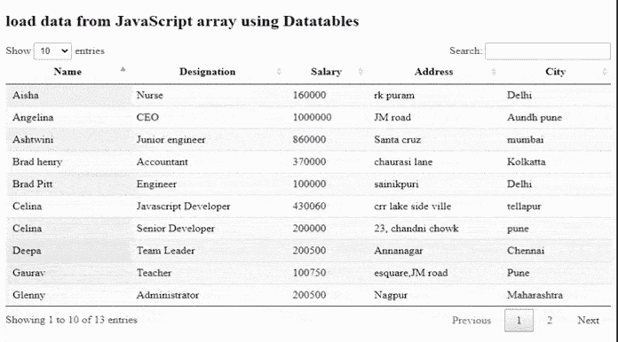

# 如何使用 jQuery DataTables 插件从 JavaScript 数组加载数据？

> 原文:[https://www . geesforgeks . org/如何从 javascript 加载数据-数组-使用-jquery-datatables-plugin/](https://www.geeksforgeeks.org/how-to-load-data-from-javascript-array-using-jquery-datatables-plugin/)

**数据表**是一个现代的 jQuery 插件，用于为我们的网页的 HTML 表格添加交互式和高级控件。这是一个简单易用的插件，为开发人员的自定义更改提供了大量选项。DataTable 插件的常见特性是分页、多列排序、排序和搜索。

代码实现所需的预编译文件有

CSS:

```html
https://cdn.datatables.net/1.10.22/css/jquery.dataTables.min.css
```

**JavaScript :**

```html
//cdn.datatables.net/1.10.22/js/jquery.dataTables.min.js
```

**方法:**遵循的方法是将动态数据传递给数据表，而不是从任何文档传递信息。采取的步骤如下。**T3】**

*   传递一个 JavaScript 数组*数据集*给用户数据，其中名称、名称、工资和地址作为要使用的数据。
*   HTML 表格使用表格 id 作为*表格 ID* 。
*   Datatable 用表 id 初始化。
*   在脚本部分，使用*数据*选项传递 JS 数组。
*   甚至列都是使用*列动态创建的。*

**示例:**以下示例演示了如何使用插件从数据表中的 JavaScript 数组加载数据。

## 超文本标记语言

```html
<!DOCTYPE html>
<html>

<head>
    <meta content="initial-scale=1, maximum-scale=1, 
        user-scalable=0" name="viewport" />

    <meta name="viewport" content="width=device-width" />

    <!-- Datatable plugin CSS file -->
    <link rel="stylesheet" href=
"https://cdn.datatables.net/1.10.22/css/jquery.dataTables.min.css" />

     <!-- jQuery library file -->
     <script type="text/javascript" 
         src="https://code.jquery.com/jquery-3.5.1.js">
     </script>

      <!-- Datatable plugin JS library file -->
     <script type="text/javascript" src=
"https://cdn.datatables.net/1.10.22/js/jquery.dataTables.min.js">
     </script>
</head>

<body>
    <h2>load data from JavaScript array using Datatables</h2>

    <!--HTML table with student data-->
    <table id="tableID" class="display" style="width:100%">
        <thead>
            <tr>
                <th>User name</th>
                <th>Designation</th>
                <th>Salary</th>
                <th>Address</th>
                <th>City</th>                
            </tr>
        </thead>
    </table>

    <script>
    var dataSet = [
    [

      "Tina Mukherjee",
       "BPO member",
       "300000",
        "24,chandni chowk",
        "Pune"    
    ],
    [
     "Gaurav",
      "Teacher",
      "100750",
      "esquare,JM road",
      "Pune"     
    ],
    [
       "Ashtwini",     
         "Junior engineer",
         "860000",  
        "Santa cruz",
        "mumbai"    
    ],
    [
         "Celina",     
         "Javascript Developer",
         "430060",
         "crr lake side ville",
         "tellapur"     
    ],
    [
        "Aisha",     
         "Nurse",
         "160000",
        "rk puram",
        "Delhi"     
    ],
    [
        "Brad henry",     
         "Accountant",
         "370000",  
        "chaurasi lane",
        "Kolkatta"     
    ],
    [
         "Harry",    
         "Salesman",
         "130500",
         "32, krishna nagar",
         "Navi mumbai"    
    ],
    [
      "Rhovina",
      "Amazon supporter",
      "300900",    
      "Aparna zone",
      "hyderabad"
     ],
    [
      "Celina",
      "Senior Developer",
      "200000",
      "23, chandni chowk",
      "pune"  
    ],     
    [
      "Glenny",
      "Administrator",
       "200500",
       "Nagpur",
       "Maharashtra"    
    ],
    [
      "Brad Pitt",
       "Engineer",
       "100000",
        "sainikpuri",
        "Delhi"  
    ],
    [
         "Deepa",    
         "Team Leader",
         "200500",     
        "Annanagar",
        "Chennai"    
    ],

    [
      "Angelina",     
         "CEO",
         "1000000",   
        "JM road",
        "Aundh pune"

    ]
 ];

    $(document).ready(function() {
        $('#tableID').DataTable( {
            data: dataSet,
            columns: [
                { title: "Name" },
                { title: "Designation" },
                { title: "Salary" },
                { title: "Address" },
                { title: "City" }       

            ]
        } );
    } );
</script>
</body>

</html>
```

**输出:**

**执行前:**



**执行后:**

