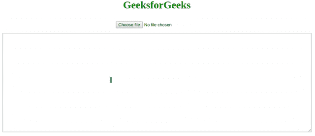

# 如何将文本文件的内容加载到 JavaScript 变量中？

> 原文:[https://www . geesforgeks . org/如何将文本文件的内容加载到 javascript 变量中/](https://www.geeksforgeeks.org/how-to-load-the-contents-of-a-text-file-into-a-javascript-variable/)

在本文中，我们将研究如何使用 JavaScript 将您计算机上存在的任何文本文件的内容读入一个变量。

下面是一些基本的提示，每个人在看代码之前都应该浏览一下:

*   **[事件监听器:](https://www.geeksforgeeks.org/javascript-addeventlistener-with-examples/)** 这些是 JavaScript 中存在的预定义函数。它们采用两个参数，第一个参数是元素应该寻找/监听的事件，第二个参数是元素在第一个参数中提到的事件发生时应该执行的操作。
*   **[正则表达式:](https://www.geeksforgeeks.org/javascript-regular-expressions/)** 正则表达式是一个字符序列。每个正则表达式都定义了一个特定的模式，可以用于多种目的。最常见的是模式匹配。如上所述，正则表达式最常用于模式匹配，在发现字符的预期模式后，可以对其应用许多功能，如 **split()** 、 **join()** 、 **replace()** 等。

**示例:**在本例中，我们将创建一个文本区域，文本将出现在该文本文件中，该文本文件已在**index.html**中用作输入。JavaScript 代码将能够从任何文本文件中提取文本，并将其显示在 **script.js** 中。

*   **index.html:**

    ```html
    <!DOCTYPE html>
    <html>

    <head>
        <title>Text file reading</title>
        <meta charset="utf-8">
        <meta name="viewport" 
              content="width=device-width, initial-scale=1.0">

    </head>
    <style type="text/css">
        div {
            display: flex;
            flex-direction: column;
            align-items: center;
        }

        input {
            margin-top: 10px;
        }

        textarea {
            margin-top: 15px;
            width: 70%;
        }
    </style>

    <body>
        <center>
            <h1 style="color: green;">
              GeeksforGeeks
            </h1>
            <div>
                <input type="file">
                <textarea cols="30" rows="20" 
                          placeholder="text will appear here">
                </textarea>
            </div>
        </center>
        <script src="script.js"></script>
    </body>

    </html>
    ```

    *   **script.js:**

    ```html
    let input = document.querySelector('input')

    let textarea = document.querySelector('textarea')

    // This event listener has been implemented to identify a
    // Change in the input section of the html code
    // It will be triggered when a file is chosen.
    input.addEventListener('change', () => {
        let files = input.files;

        if (files.length == 0) return;

        /* If any further modifications have to be made on the
           Extracted text. The text can be accessed using the 
           file variable. But since this is const, it is a read 
           only variable, hence immutable. To make any changes, 
           changing const to var, here and In the reader.onload 
           function would be advisible */
        const file = files[0];

        let reader = new FileReader();

        reader.onload = (e) => {
            const file = e.target.result;

            // This is a regular expression to identify carriage 
            // Returns and line breaks
            const lines = file.split(/\r\n|\n/);
            textarea.value = lines.join('\n');

        };

        reader.onerror = (e) => alert(e.target.error.name);

        reader.readAsText(file);
    });
    ```

    **输出:** 

    CSS 是网页的基础，通过设计网站和网络应用程序用于网页开发。你可以通过以下 [CSS 教程](https://www.geeksforgeeks.org/css-tutorials/)和 [CSS 示例](https://www.geeksforgeeks.org/css-examples/)从头开始学习 CSS。