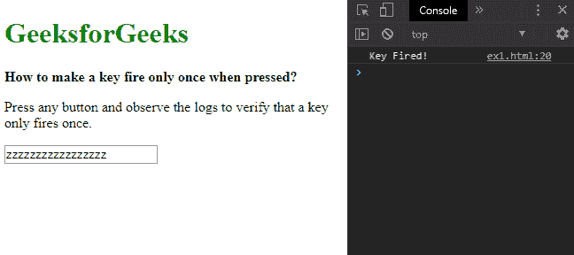
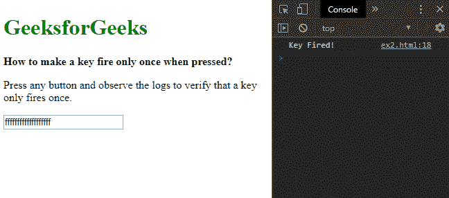

# 使用 JavaScript 按下按键时如何使按键起火？

> 原文:[https://www . geeksforgeeks . org/如何使用 javascript 制作一个按键-按键时开火/](https://www.geeksforgeeks.org/how-to-make-a-key-fire-when-key-is-pressed-using-javascript/)

在 JavaScript 中，按住一个键将持续激发该键，直到它被释放。这种行为可能用于游戏等应用程序，在这些应用程序中，即使按住某个键，也可能只触发一次。这可以通过两种方法实现:

**方法 1:使用标志变量检查当前按键状态:**定义一个标志变量来跟踪当前按键。“向上键”和“向下键”事件都设置为修改此标志变量，以便它正确反映按键的当前状态。

“keydown”事件只允许在没有通过检查标志变量按住键的情况下触发相应的事件。另一方面,“keyup”事件设置标志变量来指示该键已经被释放。将这两者与事件侦听器一起使用，可以确保即使按住键也只触发一次。

**语法:**

```
let isPressed = false;

element.onkeydown = function (e) {
    if (!isPressed) {
        isPressed = true;
        console.log('Key Fired!');
    }
};

element.onkeyup = function (e) {
    isPressed = false;
}
```

**示例:**

```
<!DOCTYPE html>
<html>

<head>
    <title>
        How to make a key fire when key
        pressed using JavaScript ?
    </title>
</head>

<body>
    <h1 style="color: green">
        GeeksforGeeks
    </h1>

    <b>
        How to make a key fire only
        once when pressed?
    </b>

    <p>
        Press any button and observe
        the logs to verify that a key
        only fires once.
    </p>

    <input type="text">

    <script type="text/javascript">
        let element = document.querySelector('input');
        let isPressed = false;

        element.onkeydown = function (e) {
            if (!isPressed) {
                isPressed = true;
                console.log('Key Fired!');
            }
        };

        element.onkeyup = function (e) {
            isPressed = false;
        }
    </script>
</body>

</html>
```

**输出:**


**方法二:使用 repeat 属性:**KeyboardEvent 接口的“repeat”属性用于检查某个按键是否因为被用户按住而重复。可以在每个“keydown”事件上检查此属性，并且仅当指定事件返回 false 时才允许它激发。这防止了即使用户按住键也多次击键。

**语法:**

```
element.onkeydown = function (e) {
    if (!e.repeat) {
        console.log("Key Fired!");
    }
};
```

**示例:**

```
<!DOCTYPE html>
<html>

<head>
    <title>
        How to make a key fire when key
        pressed using JavaScript ?
    </title>
</head>

<body>
    <h1 style="color: green">
        GeeksforGeeks
    </h1>

    <b>
        How to make a key fire only
        once when pressed?
    </b>

    <p>
        Press any button and observe
        the logs to verify that a key
        only fires once.
    </p>

    <input type="text">

    <script type="text/javascript">

        let element = 
            document.querySelector('input');

        element.onkeydown = function (e) {
            if (!e.repeat) {
                console.log("Key Fired!");
            }
        };
    </script>
</body>

</html>
```

**输出:**
