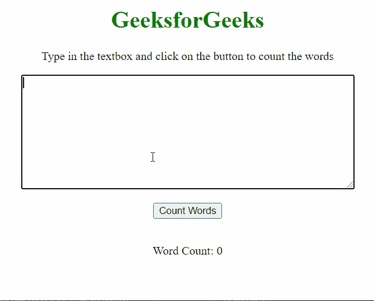
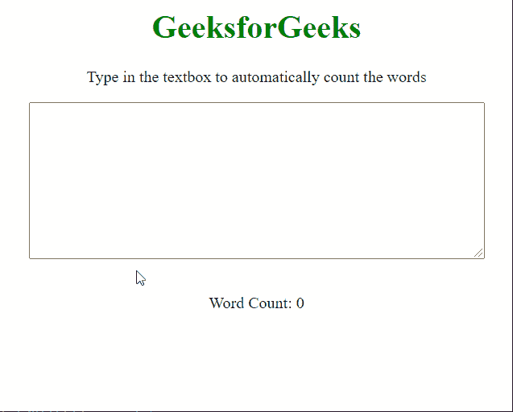
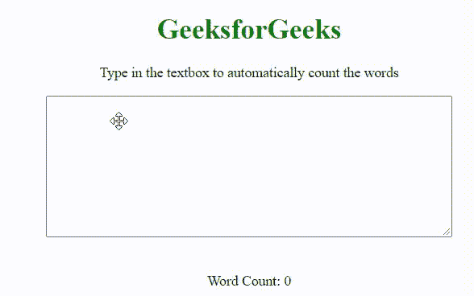

# 如何用 JavaScript 在 textarea 中进行字数统计？

> 原文:[https://www . geesforgeks . org/如何使用 javascript 在 textarea 中进行字数统计/](https://www.geeksforgeeks.org/how-to-make-a-word-count-in-textarea-using-javascript/)

本文描述了在给定文本输入中计算字数的方法。这在建议用户输入一定数量的单词并且单词计数器可以跟踪这些单词的情况下可能会很有用。下面讨论两种方法:

**方法 1:** **计算文本中出现的空格数**

此方法依赖于输入字符串中的空格数来计算单词数，因为句子中的每个单词都由空格分隔。函数 **countWord()** 定义为，它获取文本区域中存在的文本，并计算其中存在的空格数。textarea 中的输入文本是使用 getElementById()方法选择的。

这种方法的缺点是单词之间的多个空格将被视为多个单词，因此这可能导致单词计数不可靠。

**示例:**

## 超文本标记语言

```html
<!DOCTYPE html>
<html>

<body style="text-align: center;">

    <h1 style="color: green">
        GeeksforGeeks
    </h1>

<p>
        Type in the textbox and click on
        the button to count the words
    </p>

    <textarea id="inputField" rows=10 cols="60">
    </textarea>
    <br><br>

    <button onclick="countWords()">
        Count Words
    </button>
    <br><br>

<p> Word Count:
        <span id="show">0</span>
    </p>

    <script>
        function countWords() {

            // Get the input text value
            var text = document
                .getElementById("inputField").value;

            // Initialize the word counter
            var numWords = 0;

            // Loop through the text
            // and count spaces in it
            for (var i = 0; i < text.length; i++) {
                var currentCharacter = text[i];

                // Check if the character is a space
                if (currentCharacter == " ") {
                    numWords += 1;
                }
            }

            // Add 1 to make the count equal to
            // the number of words
            // (count of words = count of spaces + 1)
            numWords += 1;

            // Display it as output
            document.getElementById("show")
                .innerHTML = numWords;
        }
    </script>
</body>

</html>
```

**输出:**



**方法二:根据空格分隔单词，然后统计单词数量**

在这种方法中，我们通过在空格字符的基础上拆分单词，然后检查每个拆分不仅仅是空格字符，来改进以前方法的缺点。每当用户使用文本区域上的 oninput 事件处理程序在文本区域中键入内容时，都会调用 countWord()函数。

**示例:**

## 超文本标记语言

```html
<!DOCTYPE html>
<html>

<body style="text-align: center;">
    <h1 style="color: green">
        GeeksforGeeks
    </h1>

<p>
        Type in the textbox to
        automatically count the words
    </p>

    <textarea id="word" oninput="countWord()"
        rows="10" cols="60">
    </textarea>
    <br><br>

<p> Word Count:
        <span id="show">0</span>
    </p>

    <script>
        function countWord() {

            // Get the input text value
            var words = document
                .getElementById("word").value;

            // Initialize the word counter
            var count = 0;

            // Split the words on each
            // space character
            var split = words.split(' ');

            // Loop through the words and
            // increase the counter when
            // each split word is not empty
            for (var i = 0; i < split.length; i++) {
                if (split[i] != "") {
                    count += 1;
                }
            }

            // Display it as output
            document.getElementById("show")
                .innerHTML = count;
        }
    </script>
</body>

</html>
```

**输出:**



**方法 3:** 由于上述两种方法只能够在给定空格的情况下对连续书写的单词进行计数，但是当每个单词以新的一行开始时，它不能对数字进行计数。因此，这种方法将能够从新行开始计数单词。

**示例:**

## 超文本标记语言

```html
<!DOCTYPE html>
<html>
  <body style="text-align: center">
    <h1 style="color: green">GeeksforGeeks</h1>

<p>Type in the textbox to automatically count the words</p>

    <textarea id="word" rows="10" cols="60"> </textarea>
    <br /><br />

<p>
      Word Count:
      <span id="show">0</span>
    </p>

    <script>
      document
        .querySelector("#word")
        .addEventListener("input", function countWord() {
          let res = [];
          let str = this.value.replace(/[\t\n\r\.\?\!]/gm, " ").split(" ");
          str.map((s) => {
            let trimStr = s.trim();
            if (trimStr.length > 0) {
              res.push(trimStr);
            }
          });
          document.querySelector("#show").innerText = res.length;
        });
    </script>
  </body>
</html>
```

**输出:**

