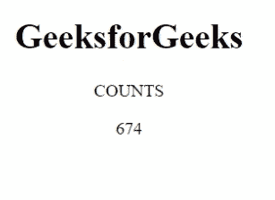
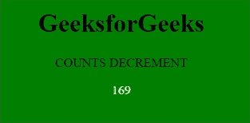

# 如何用 JavaScript 制作动画计数器？

> 原文:[https://www . geesforgeks . org/如何制作动画-反使用-javascript/](https://www.geeksforgeeks.org/how-to-make-animated-counter-using-javascript/)

在本文中，我们将使用 [JavaScript](https://www.geeksforgeeks.org/javascript-tutorial/) 和基本的 [HTML](https://www.geeksforgeeks.org/html-tutorials/) 来创建一个动画计数器进行设计。

动画计数器用于显示动画中从 0 开始到特定数字结束的计数。这通常被许多网站用来使网页更有吸引力。

**进场:**

*   在 HTML [正文](https://www.geeksforgeeks.org/html-body-tag/)标签中，用 [id 指定](https://www.geeksforgeeks.org/difference-between-an-id-and-class-in-html) [div](https://www.geeksforgeeks.org/div-tag-html/) 标签。
*   将 JavaScript 代码添加到[脚本标签](https://www.geeksforgeeks.org/html-script-tag/)中。
*   使用[设置间隔()](https://www.geeksforgeeks.org/java-script-settimeout-setinterval-method/)方法执行更新功能，该功能将增加计数值。
*   使用 [getElementById()](https://www.geeksforgeeks.org/html-dom-getelementbyid-method/) 方法获取 id，使用 [innerHTML](https://www.geeksforgeeks.org/html-dom-innerhtml-property/) 属性显示计数。
*   如果计数值达到要求的计数，则使用 [clearInterval()](https://www.geeksforgeeks.org/javascript-cleartimeout-clearinterval-method/) 方法停止执行代码。

[setInterval()](https://www.geeksforgeeks.org/java-script-settimeout-setinterval-method/) 方法在每个给定的时间间隔重复一个给定的函数，并且该方法一直执行到调用 [clearInterval()](https://www.geeksforgeeks.org/javascript-cleartimeout-clearinterval-method/) 为止。

**注:**请参考上述文章链接，以便更好理解。

**示例 1:** 在下面的代码中，我们采用了变量“*counts”*，该变量执行 [setInterval()](https://www.geeksforgeeks.org/java-script-settimeout-setinterval-method/) 方法，该方法调用 *updated()* 函数。一旦“*up”*变量值达到 1000，则执行 [clearInterval()](https://www.geeksforgeeks.org/javascript-cleartimeout-clearinterval-method/) 方法。我们已经将计数器的值从 0 增加到 1000。

## 超文本标记语言

```html
<!DOCTYPE html>
<html lang="en">

<body style="text-align:center">
    <h1>GeeksforGeeks</h1>
    <p>COUNTS</p>
    <div id="counter">
        <!-- counts -->
    </div>

    <script>
        let counts=setInterval(updated);
        let upto=0;
        function updated(){
            var count= document.getElementById("counter");
            count.innerHTML=++upto;
            if(upto===1000)
            {
                clearInterval(counts);
            }
        }
    </script>
</body>
</html>
```

**输出:**



**示例 2:** 使用 JavaScript 将计数器值从 1000 递减为 0。我们在[正文](https://www.geeksforgeeks.org/html-body-tag/)标签的[样式](https://www.geeksforgeeks.org/html-style-tag/)标签下增加了一些 CSS 样式，让网页更有吸引力。

## 超文本标记语言

```html
<!DOCTYPE html>
<html lang="en">
<head>
    <style>
        body{
            background-color: green;
        }
        #counter{
            color:white;
        }
    </style>
</head>
<body style="text-align:center">
    <h1>GeeksforGeeks</h1>
    <p>COUNTS DECREMENT</p>
    <div id="counter">
        <!-- counts -->
    </div>

    <script>
        let counts=setInterval(updated);
        let upto=1000;
        function updated(){
            var count= document.getElementById("counter");
            count.innerHTML=--upto;
            if(upto === 0) {
                clearInterval(counts);
            }
        }
    </script>
</body>
</html>
```

**输出:**

