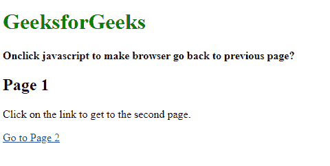
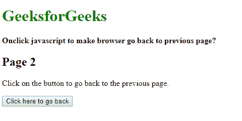

# 如何用 JavaScript 让浏览器回到上一页？

> 原文:[https://www . geesforgeks . org/如何使用 javascript 让浏览器返回上一页/](https://www.geeksforgeeks.org/how-to-make-browser-to-go-back-to-previous-page-using-javascript/)

有两种流行的方法可以让浏览器通过单击 JavaScript 事件返回到上一页，这两种方法描述如下:

**方法 1:使用 history.go()方法:****窗口的 **go()** 方法. history** 对象用于从会话历史加载页面。它可用于使用 delta 参数的值向前或向后移动。一个正的增量参数意味着页面将在历史中前进。同样，负增量值会使页面返回到上一页。
该方法可以使用“-1”作为增量值，在历史中返回一页。onclick 事件可以用方法指定，以返回历史记录中的一页。

**语法:**

```
window.history.go(-1)
```

**注意:**如果我们想后退一步以上，那么将δ的值从“-1”增加到您想要的值。

**例:**

## 第 1 页

```
<!DOCTYPE html>
<html>

<head>
    <title>
        How to make browser to go back to
        previous page using JavaScript ?
    </title>
</head>

<body>
    <h1 style="color: green">
        GeeksforGeeks
    </h1>

    <b>
        Onclick javascript to make browser
        go back to previous page?
    </b>

    <h2>Page 1</h2>

    <p>
        Click on the link to get
        to the second page.
    </p>

    <a href="page2.html">Go to Page 2</a>
</body>

</html>
```

## 第 2 页

```
<!DOCTYPE html>
<html>

<head>
     <title>
        How to make browser to go back to
        previous page using JavaScript ?
    </title>
</head>

<body>
    <h1 style="color: green">
        GeeksforGeeks
    </h1>

    <b>
        Onclick javascript to make browser
        go back to previous page?
    </b>

    <h2>Page 2</h2>

    <p>
        Click on the button to go back
        to the previous page.
    </p>

    <button onclick="history.go(-1)">
        Click here to go back
    </button>
</body>

</html>
```

**Output:**

*   **点击链接前:**
    
*   **点击链接后:**
    
*   **点击按钮后:**
    

**方法 2:使用 history.back()方法:****窗口的 **back()** 方法. history** 对象用于返回当前会话历史中的上一页。如果没有上一页，这个方法调用什么也不做。
可以用这个方法指定 onclick 事件，返回历史一页。

**语法:**

```
window.history.back()
```

**例:**

## 第 1 页

```
<!DOCTYPE html>
<html>

<head>
    <title>
        Onclick javascript to make browser go
        back to previous page?
    </title>
</head>

<body>
    <h1 style="color: green">
        GeeksforGeeks
    </h1>

    <b>
        Onclick javascript to make browser
        go back to previous page?
     </b>

    <h2>Page 1</h2>

    <p>
        Click on the link to get
        to the second page.
    </p>

    <a href="page2.html">Go to Page 2</a>
</body>

</html>
```

## 第 2 页

```
<!DOCTYPE html>
<html>

<head>
    <title>
        Onclick javascript to make browser
        go back to previous page?
    </title>
</head>

<body>
    <h1 style="color: green">
        GeeksforGeeks
    </h1>

    <b>
        Onclick javascript to make browser 
        go back to previous page?
    </b>

    <h2>Page 2</h2>

    <p>
        Click on the button to go
        back to the previous page.
    </p>

    <button onclick="history.back()">
        Click here to go back
    </button>
</body>

</html>
```

**Output:**

*   **点击链接前:**
    
*   **点击链接后:**
    
*   **点击按钮后:**
    