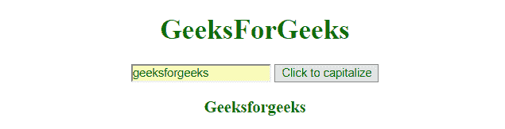
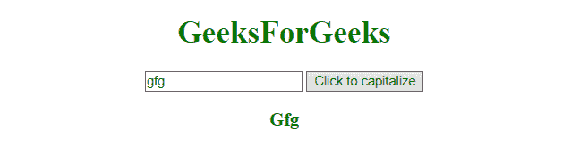

# 如何在 JavaScript 中将字符串的首字母大写？

> 原文:[https://www . geeksforgeeks . org/如何在 javascript 中创建大写字母字符串的第一个字母/](https://www.geeksforgeeks.org/how-to-make-first-letter-of-a-string-uppercase-in-javascript/)

在 **JavaScript** 中，有多种方法可以将字符串的第一个字母大写。以下是一些方法:

1.  **toUpperCase()**:
    This function applies on a string and change the all letters to uppercase.
    **Syntax:**

    ```
    string.toUpperCase()

    ```

    **返回值:**该函数返回大写字符串。

2.  **slice()**:
    This function applies on a string and slice it according to the passed parameter.
    **Syntax:**

    ```
    string.slice(start, end)

    ```

    *   **开始:**此参数为必填项。它指定开始切片的位置。索引从位置 0 开始。
    *   **结束:**此为可选参数。它指定从哪里开始结束切片的位置(不包括结束)。如果省略此参数，它将从开始选择所有字符。

    **返回值:**该函数返回切片后的字符串。

3.  **charAt()** :
    这个 charAt()函数返回字符串中给定位置的字符。
    **语法:**

```
string.charAt(index)

```

**返回值:**此函数返回字符串中指定位置的字符。

8.  **replace()**:
    This is an built-in function in JavaScript which is used to replace a slice of a string with another string or a regular expression. Original string will not affected.
    **Syntax:**

    ```
    str.replace(A, B)

    ```

    **参数:**这里的参数 A 是正则表达式，B 是将替换给定字符串内容的字符串。
    **返回值:**返回一个有替换项的新字符串。

    **Example 1:**

    ```
    <!DOCTYPE html>  
    <html>  
        <head> 
            <title></title>
        </head> 

        <body style = "text-align:center;">  

            <h1 style = "color:green;" >  
                GeeksForGeeks  
            </h1>  

            <input id = "input" type="text" name="input"/> 
            <button onclick="capitalizeFLetter()"> 
                Click to capitalize
            </button> 
            <h3 id = "div" style="color: green">
            </h3>

            <script> 

            function capitalizeFLetter() {
              var input = document.getElementById("input");
              var x = document.getElementById("div");
              var string = input.value;
              x.innerHTML = string[0].toUpperCase() + 
                string.slice(1);
            }
            </script> 
        </body>  
    </html>
    ```

    **输出:**

    *   **点击按钮前:**
        
    *   **After clicking the button:**
        

        **示例 2:** 本示例使用 slice()方法使字符串的第一个字母大写。

        ```
        <!DOCTYPE html>  
        <html>  
            <head> 
                <title></title>
            </head> 

            <body style = "text-align:center;">  

                <h1 style = "color:green;" >  
                    GeeksForGeeks  
                </h1>  

                <input id = "input" type="text" name="input"/> 
                <button onclick="capitalizeFLetter()"> 
                    Click to capitalize
                </button> 
                <h3 id = "div" style="color: green">
                </h3>

                <script> 

                function capitalizeFLetter() {
                  var input = document.getElementById("input");
                  var x = document.getElementById("div");
                  var string = input.value;
                  x.innerHTML = string.charAt(0).toUpperCase() +
                   string.slice(1);
                }
                </script> 
            </body>  
        </html>
        ```

        **输出:**

        *   **点击按钮前:**
            
        *   **After clicking the button:**
            

            **示例 3:** 本示例使用 string.replace()方法将字符串的第一个字母大写。

            ```
            <!DOCTYPE html>  
            <html>  
                <head> 
                    <title></title>     
                </head> 

                <body style = "text-align:center;">  

                    <h1 style = "color:green;" >  
                        GeeksForGeeks  
                    </h1>       
                    <input id = "input" type="text" name="input"/> 
                    <button onclick="capitalizeFLetter()"> 
                        Click to capitalize
                    </button> 
                    <h3 id = "div" style="color: green">
                    </h3>

                    <script> 

                    function capitalizeFLetter() {
                      var input = document.getElementById("input");
                      var x = document.getElementById("div");
                      var string = input.value;
                      x.innerHTML = 
                       string.replace(/^./, string[0].toUpperCase());
                    }
                    </script> 
                </body>  
            </html>
            ```

            **输出:**

            *   **点击按钮前:**
                
            *   **点击按钮后:**
                