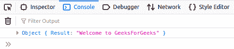

# 如何在 JavaScript 中使用 Axios 对 API 进行 GET 调用？

> 原文:[https://www . geesforgeks . org/如何使用 axios-in-javascript 调用 API/](https://www.geeksforgeeks.org/how-to-make-get-call-to-an-api-using-axios-in-javascript/)

Axios 是一款基于**承诺的** HTTP 客户端，专为 **Node.js** 和浏览器设计。借助 Axios，我们可以轻松地向 REST APIs 发送异步 HTTP 请求，并执行创建、读取、更新和删除操作。这是一个托管在 Github 上的开源协作项目。它可以用普通的 Javascript 或任何相应的库导入。
以下脚本 src 将在 HTML 代码
的头部包含 **axios.js**

```html
<script src="https://unpkg.com/axios/dist/axios.min.js"></script>
```

当我们使用 axios 向 API 发送请求时，它会返回一个响应。响应对象包括:

*   **数据:**服务器返回的数据。
*   **状态:**服务器返回的 HTTP 代码。
*   **状态文本:**服务器返回的 HTTP 状态。
*   **头:**从服务器获取的头。
*   **配置:**原始请求配置。
*   **请求:**请求对象。

为了演示，我们将在本地主机上托管一个 API:

```html
http://127.0.0.1:5000
```

**Python 脚本:**您将需要以下包来运行 API、 **flask、requests、jsonify、flask_cors** 。Python 应用编程接口的代码如下:

*   **节目:**

## 蟒蛇 3

```html
from flask import Flask, jsonify, request
from flask_cors import CORS

app = Flask(__name__)
CORS(app)

@app.route('/test', methods =['GET'])
def test():
   return jsonify({"Result": "Welcome to GeeksForGeeks"})

if __name__ == '__main__':
    app.run(debug = True)
```

**注意:**只需运行上面的 python 代码，就可以托管这个 API。
**JS 脚本:**在 HTML 文件中包含 axios.js 和对应的 JS 文件。在 JS 文件中，编写以下代码，该代码使用 Axios 向 API 发出 GET 请求。对应用编程接口的获取请求需要应用编程接口方法的**路径。** 

*   **节目:**

## java 描述语言

```html
function makeGetRequest(path) {
    axios.get(path).then(
        (response) => {
            var result = response.data;
            console.log(result);
        },
        (error) => {
            console.log(error);
        }
    );
}
makeGetRequest('http://127.0.0.1:5000/test');
```

*   **输出:**它会用 GET 请求调用 API。响应将在**控制台窗口**上获得。

