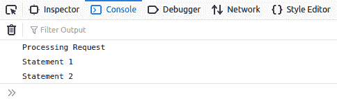
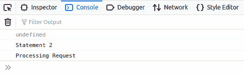

# 如何让 JavaScript 等待一个 API 请求返回？

> 原文:[https://www . geesforgeks . org/how-make-JavaScript-等待 a-API-请求返回/](https://www.geeksforgeeks.org/how-to-make-javascript-wait-for-a-api-request-to-return/)

**先决条件:**[Javascript 中的异步/等待功能](https://www.geeksforgeeks.org/async-await-function-in-javascript/)

JavaScript 是一种**同步**语言，即 JavaScript 一次执行一行代码。它将正在运行的事件排队，并按顺序执行它们。但是在某些情况下，Javascript 表现为**异步**，例如在 **AJAX** 或 **Axios** 调用中。它调用应用编程接口，但不等待应用编程接口返回结果，并继续下一个排队事件。

[**JavaScript 中的异步/等待函数**](https://www.geeksforgeeks.org/async-await-function-in-javascript/) 将为这类 API 调用提供延迟程序的帮助。异步和等待功能按照 JavaScript 中[的承诺执行。](https://www.geeksforgeeks.org/javascript-promises/)

*   **Async:** 它让 javascript 执行基于 promise 的代码，就好像它们是同步的一样，并在不中断执行线程的情况下返回值。如果没有返回值，它将包装承诺并恢复正常执行。
*   **Await:** 用来等待承诺的回报。它只在异步块中使用。

**Python 脚本:**我们将调用本地主机上托管的 Python API，该 API 返回一个基本句子。该应用编程接口的代码如下:

*   **Program:**

    ```
    from flask import Flask, jsonify, request
    from flask_cors import CORS

    app = Flask(__name__)
    CORS(app)

    @app.route('/test', methods =['GET'])
    def test():
        return jsonify({"result": "Statement 1"})

    if __name__ == '__main__':
        app.run(debug = True)
    ```

    **注意:**您必须安装以下软件包才能托管此 API: **flask，jsonify，request，flask_cors** 。只需运行 python 代码，即可在**上启动 API**

    **JS 脚本:**下面的代码是一个没有 Async/Await 函数调用 API 的 Javascript 程序。

    *   **Program:**

    ```
    function makeGetRequest(path) {
        axios.get(path).then(
            (response) => {
                var result = response.data;
                console.log('Processing Request');
                return (result);
            },
            (error) => {
                console.log(error);
            }
        );
    }
    function main() {
        var response = makeGetRequest('http://127.0.0.1:5000/test');
        console.log(response);
        console.log('Statement 2');
    }
    main();
    ```

    **预期产量:**
    

    **获得的输出:**
    

    **解释:**之所以会出现这种情况，是因为 JavaScript 调用了 API，使其成为一个单独的进程，然后继续进行。它找到了 console.log(响应)；，但当时响应尚未签名，因此控制台显示 undefined。该计划取得了进展，并打印了“声明 2”。此时，应用编程接口甚至还没有到达处理语句。这就是 Javascript 表现为异步语言的地方。使用异步/等待功能可以解决这个问题。下面给出了建立承诺的相应代码。

    *   **程序:**

        ```
        function makeGetRequest(path) {
            return new Promise(function (resolve, reject) {
                axios.get(path).then(
                    (response) => {
                        var result = response.data;
                        console.log('Processing Request');
                        resolve(result);
                    },
                        (error) => {
                        reject(error);
                    }
                );
            });
        }

        async function main() {
            var result = await makeGetRequest('http://127.0.0.1:5000/test');
            console.log(result.result);
            console.log('Statement 2');
        }
        main();
        ```

    *   **输出:**
        

    **解释:**异步函数使函数在同一线程上继续执行，而不中断一个单独的事件。await 关键字标记了程序必须等待承诺返回的点。因此，程序等待应用编程接口返回响应，然后继续执行程序，因此，输出按照要求是完美的。