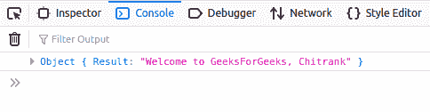

# 如何在 JavaScript 中使用 Axios.js 对一个 API 进行 POST 调用？

> 原文:[https://www . geeksforgeeks . org/如何使用-axios-js-in-javascript/](https://www.geeksforgeeks.org/how-to-make-post-call-to-an-api-using-axios-js-in-javascript/) 进行 api 后调用

Axios 是一款基于**承诺的** HTTP 客户端，专为 **Node.js** 和浏览器设计。借助 Axios，我们可以轻松地向 REST APIs 发送异步 HTTP 请求，并执行创建、读取、更新和删除操作。这是一个托管在 Github 上的开源协作项目。它可以用普通的 Javascript 或任何相应的库导入。
以下脚本 src 将在 HTML 代码
的头部包含 **axios.js**

```
<script src="https://unpkg.com/axios/dist/axios.min.js"></script>
```

当我们使用 axios 向 API 发送请求时，它会返回一个响应。响应对象包括:

*   **数据:**服务器返回的数据。
*   **状态:**服务器返回的 HTTP 代码。
*   **状态文本:**服务器返回的 HTTP 状态。
*   **头:**从服务器获取的头。
*   **配置:**原始请求配置。
*   **请求:**请求对象。

出于演示的目的，我们将在本地主机上托管一个 API:

```
http://127.0.0.1:5000
```

**Python 脚本:**您将需要以下包来运行 API: **flask，requests，jsonify，flask_cors** 。Python 应用编程接口的代码如下:

*   **节目:**

## 蟒蛇 3

```
from flask import Flask, jsonify, request
from flask_cors import CORS

app = Flask(__name__)
CORS(app)

@app.route('/test', methods =['POST'])
def test():
   return jsonify({"Result": "Welcome to GeeksForGeeks, "
                                   +request.json['name']})

if __name__ == '__main__':
    app.run(debug = True)
```

**注意:**只需运行上面的 python 代码，就可以托管这个 API。
**JS 脚本:**在 HTML 文件中包含 **axios.js** 和对应的 JS 文件。在 JS 文件中，编写以下代码，使用 axios 向 API 发出 POST 请求。对应用编程接口的开机自检请求需要以下变量:

*   **路径:**API 方法的路径。
*   **查询对象:**包含开机自检调用头数据的查询对象。查询对象是 Javascript 对象的形式。例如:{名称:' GeeksForGeeks '，类型:'网站' }

*   **节目:**

## java 描述语言

```
function makePostRequest(path, queryObj) {
    axios.post(path, queryObj).then(
        (response) => {
            var result = response.data;
            console.log(result);
        },
        (error) => {
            console.log(error);
        }
    );
}

queryObj = { name: 'Chitrank' };
makePostRequest('http://127.0.0.1:5000/test', queryObj);
```

*   **输出:**它会用一个携带上述头数据的 POST 请求调用 API。获得的响应将在**控制台窗口**上获得。

