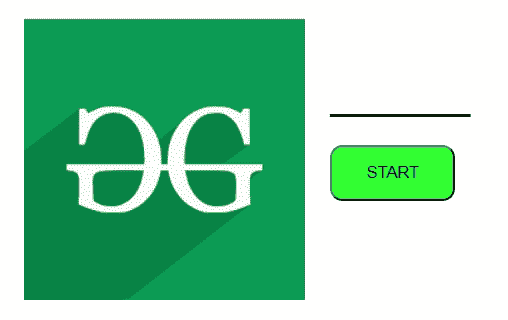
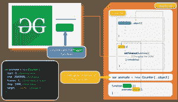

# 如何用 JavaScript 制作自己的 countUp.js 插件？

> 原文:[https://www . geesforgeks . org/如何制作自己的-countup-js-plugin-use-JavaScript/](https://www.geeksforgeeks.org/how-to-make-your-own-countup-js-plugin-using-javascript/)

**先决条件:**

1.  [文档对象模型](https://www.geeksforgeeks.org/dom-document-object-model/)
2.  [ES6 中类的使用](https://www.geeksforgeeks.org/es6-classes/)

如果你是 JavaScript 的初学者，并且有基本的编程知识，那么不要担心，你已经到达了一个完美的地方。

让我们把这个问题分成多个部分:

1.  使用 *HTML* 实现一个简单的结构。
2.  使用 *CSS* 提供基本显示样式。
3.  主要编程实现，行为使用 *JavaScript*
    *   ***onclick =“…”。()"** :* 触发功能
    *   创建名为**的类**
    *   **使用 ***构造函数*** 初始化类**
    *   **为动画创建名为 ***【拍摄】(*** 的方法/功能**
    *   **召唤法 ***射*** 从类 ***反*****

****第一步:实现 HTML****

## **超文本标记语言**

```html
<!---inside body---->
<div class="container">
    
    <div class="main">
        <h1 id="counter"> _______ </h1>

        <!-- This is the target id -->
        <button onclick="trigger()"> START </button>
    </div>
</div>
<!-- Inside body -->
<script>
    // Including JavaScript Code
</script>
```

****第二步:实现 CSS****

## **半铸钢ˌ钢性铸铁(Cast Semi-Steel)**

```html
.container {
    display: flex;
    padding:20px;
}

.main{
    padding:20px;
}

button{
    width:100px;
    height:45px;
    background-color:#33ff33;
    border-radius:10px;
}
```

****第三步:JavaScript****

## **java 描述语言**

```html
// Creating the Class: Object Prototype
class Counter {

    // Countructor: Initializing the Class
    constructor(data) {
        this.start = data["start"];
        this.end = data["end"];
        this.frames = data["frames"];
        this.step = data["step"];
        this.target = data["target"];
    }

    // Method for Animation
    shoot() {

        // Variables
        var count = 0;
        var stepArray = [];

        // Putting the starting Value
        document.getElementById(this.target)
            .innerHTML = this.start;

        // Storing the step value in Array
        while (this.end > this.start) {
            this.start += this.step;
            stepArray[count++] = this.start;
        }

        // Doing Countup Animation
        var functional_target = this.target;
        for (let i = 0; i < count; i++) {
            setTimeout(function () {
                document.getElementById(functional_target)
                    .innerHTML = stepArray[i];
            }, (i + 1) * this.frames);
        }

        // Placing the final value
        setTimeout(function () {
            document.getElementById(
                functional_target).innerHTML = this.end;
        }, count * frames);

    }
}

// Creating object from class
var animate = new Counter({
    start: 100000,
    end: 2000000,
    frames: 1,
    step: 1000,
    target: "counter"
});

// Triggering the Class Method
function trigger() {

    // Calling the shoot() method of the class
    animate.shoot();
}
```

****输出:****

**

自定义计数预览** 

****主要使用功能:****

*   **[**document . getelementbyid(**目标 Id **)。**](https://www.geeksforgeeks.org/html-dom-getelementbyid-method/)**
*   **[**setTimeout(函数(){** 函数在这里 **}，time delay)**](https://www.geeksforgeeks.org/java-script-settimeout-setinterval-method/)**

******概述******

****

程序的流程**** 

****这是自定义 countUp.js 的基本原型，我们可以使用 JavaScript 中的 Class 概念来实现它。****

****还可以使用自己的函数以特定的方式呈现值。****