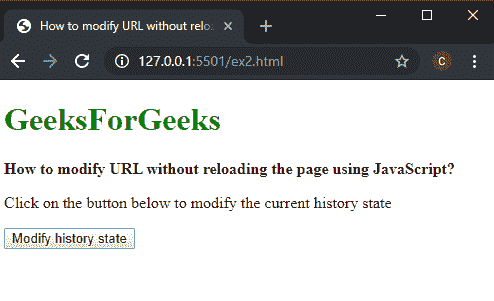
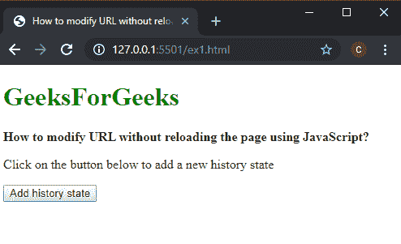
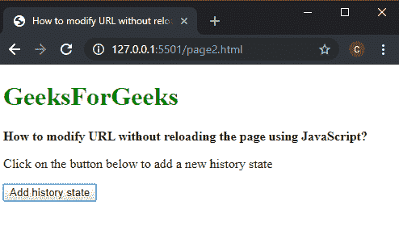

# 如何在不使用 JavaScript 重载页面的情况下修改 URL？

> 原文:[https://www . geesforgeks . org/如何使用 javascript 修改 url 而不重新加载页面/](https://www.geeksforgeeks.org/how-to-modify-url-without-reloading-the-page-using-javascript/)

**方法一:用 replaceState()替换当前状态方法:**浏览器的历史界面管理浏览器会话历史。它包括当前页面所在的选项卡或框架中所访问的页面。操作此状态可用于更改浏览器的网址，而无需重新加载页面。

**replaceState()** 方法用于修改当前历史条目，并用传递的参数中的属性替换状态的属性。

这个方法的参数有三个部分，状态对象是关于状态的可序列化对象，标题是新状态的标题，网址是状态的新网址。

可以通过将所需的网址作为字符串传递给此方法来更改该网址。这将在不重新加载页面的情况下更改页面的网址。

**示例:**

```
<!DOCTYPE html>
<html>

<head>
    <title>
        How to modify URL without reloading
        the page using JavaScript?
    </title>
</head>

<body>
    <h1 style="color: green">
        GeeksForGeeks
    </h1>

    <b>
        How to modify URL without reloading
        the page using JavaScript?
    </b>

    <p>
        Click on the button below to modify
        the current history state
    </p>

    <button onclick="modifyState()">
        Modify history state
    </button>

    <script>
        function modifyState() {
            let stateObj = { id: "100" };
            window.history.replaceState(stateObj,
                        "Page 3", "/page3.html");
        }
    </script>
</body>

</html>
```

**输出:**

*   **点击按钮前:**
    
*   **点击按钮后:**
    

**方法 2:用 pushState()添加新状态方法:****pushState()**方法用于添加新的历史条目，属性作为参数传递。这将在不重新加载页面的情况下，将当前网址更改为给定的新状态。

这个方法的参数有三个部分，状态对象是关于状态的可序列化对象，标题是状态的新标题，URL 是状态的新 URL。
可以通过将所需的 URL 作为字符串传递给此方法来更改 URL。这将在不重新加载页面的情况下更改页面的网址。

**示例:**

```
<!DOCTYPE html>
<html>

<head>
    <title>
        How to modify URL without reloading
        the page using JavaScript?
    </title>
</head>

<body>
    <h1 style="color: green">
        GeeksForGeeks
    </h1>

    <b>
        How to modify URL without reloading
        the page using JavaScript?
    </b>

    <p>
        Click on the button below to add
        a new history state
    </p>

    <button onclick="addState()">
        Add history state
    </button>

    <script>
        function addState() {
            let stateObj = { id: "100" };

            window.history.pushState(stateObj,
                     "Page 2", "/page2.html");
        }
    </script>
</body>

</html>
```

**输出:**

*   **点击按钮前:**
    
*   **点击按钮后:**
    