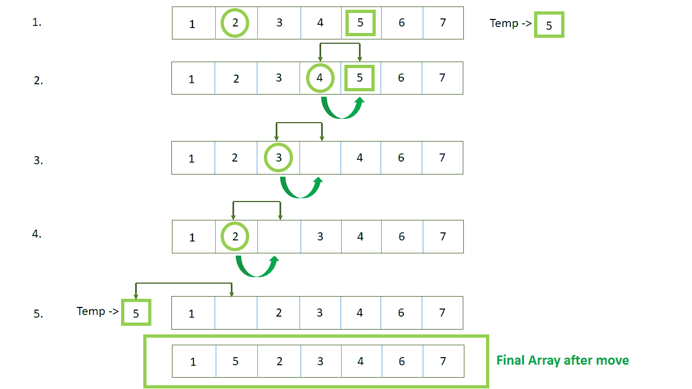

# 如何在 JavaScript 中将数组元素从一个数组位置移动到另一个数组位置？

> 原文:[https://www . geesforgeks . org/如何在 javascript 中将数组元素从一个数组位置移动到另一个数组位置/](https://www.geeksforgeeks.org/how-to-move-an-array-element-from-one-array-position-to-another-in-javascript/)

在 JavaScript 中，我们可以像 C、C++、Java 等其他编程语言一样访问数组元素。JavaScript 中还有一种叫做 [**【拼接】(**](https://www.geeksforgeeks.org/javascript-array-splice-method/) )的方法，通过这种方法，一个数组可以被一个索引的另一个元素移除或替换。所以要将一个数组元素从一个数组位置移动到另一个数组位置，我们可以[拼接() **方法**](https://www.geeksforgeeks.org/javascript-array-splice-method/) 或者我们可以简单地使用数组索引([])。



**示例:**将数组元素从一个数组位置移动到另一个数组位置的简单代码，无需使用任何函数。

## java 描述语言

```
<script>

var arr = ["C++", "Java", "JS", "Python"];

document.write("Original array: "+arr+"<br>");

    // Position where from the element is 
    // going to move here 'python' is moved 
    var x = 3; 

    // Position at which element is to be 
    // moved here 'python' is moved to  
    // index 1 which is index of 'Java'
    var pos = 1; 

    // Store the moved element in a temp 
    // variable
    var temp = arr[x]; 

    // shift elements forward 
    var i;
    for (i = x; i >= pos; i--) 
        {
            arr[i] = arr[i - 1]; 
        }

    // Insert moved element at position  
    arr[pos] = temp; 

document.write("<br>After move: "+arr+"<br>");

</script>
```

**输出:**

```
Original array: C++,Java,JS,Python

After move: C++,Python,Java,JS

```

**示例:**现在使用函数将数组元素从一个数组位置移动到另一个数组位置，

## java 描述语言

```
<script>
    var arr = ["C++ ", "Java ", "JS ",
               "Ruby ", "Python "];

    //     Print the array before moving
    document.write("Original array: "+arr+"<br>");

    // Position where from the element is 
    // going to move here 'Ruby' is moved 
    var moveEle = 3;

    // Position at which element is to be moved 
    // here 'Ruby' is moved to  index 1 which is 
    // index of 'Java'
    var moveToIndx = 1;

    // If acctual index of moved element is 
    // less than 0 when 'moveEle += array size'
    while (moveEle < 0)
    {
        moveEle += arr.length;
    }

    // Where the element to be moved f that 
    // index is less than 0 when 
    // 'moveToIndx += array size'
    while (moveToIndx < 0) 
    {
        moveToIndx = moveToIndx + arr.length;
    }

    // If 'moveToIndx' is greater than the 
    // size of the array then with need to 
    // push 'undefined' in the array.
    if (moveToIndx >= arr.length)
    {
        var un = moveToIndx - arr.length + 1;
        while (un--)
        {
            arr.push(undefined);

        }
    }
    // Here element of 'moveEle' is removed and 
    // pushed at 'moveToIndx' index
    arr.splice(moveToIndx, 0, arr.splice(moveEle, 1));

    // Print the array after moving
    document.write("<br>After move: "+arr+"<br>");
</script>
```

**输出:**

```
Original array: C++ ,Java ,JS ,Ruby ,Python

After move: C++ ,Ruby ,Java ,JS ,Python
```