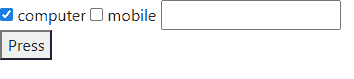
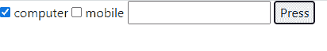

# 如何用 JavaScript 将按钮和 Checkbox、Textbox 移动到同一行？

> 原文:[https://www . geesforgeks . org/如何使用 javascript 移动复选框和文本框同一行中的按钮/](https://www.geeksforgeeks.org/how-to-move-button-in-the-same-line-with-checkbox-and-textbox-using-javascript/)

HTML DOM 中的样式“显示”属性用于将元素设置为“显示”属性。使用**内联**属性将按钮与网页的其他元素设置在同一行。

**语法:**

*   它返回“display”属性。

    ```html
    object.style.display
    ```

*   它设置“显示”属性。

    ```html
    object.style.display = inline;
    ```

**示例:**

```html
<!DOCTYPE html>
<html>

<head>

    <!-- script to set display property -->
    <script>
        function myGeeks() {
            document.getElementById("GFG")
                .style.display = "inline";
        } 
    </script>
</head>

<body>
    <div id="GFG">
        <input type="checkbox" checked> computer
        <input type="checkbox"> mobile

        <input type="text">
    </div>

    <button onclick="myGeeks()">
        Press
    </button>
</body>

</html>
```

**输出:**

*   **之前点击按钮:**
    
*   **点击按钮后:**
    