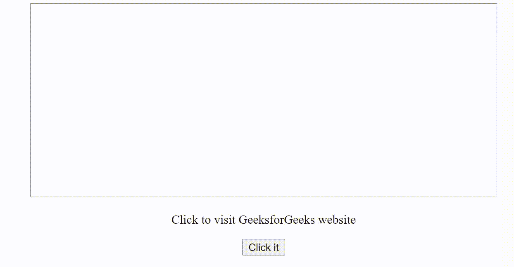
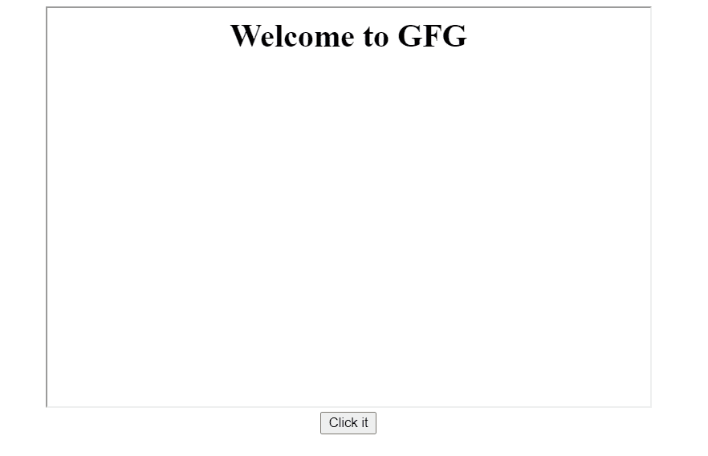

# 如何用 JavaScript 在 iframe 中导航 URL？

> 原文:[https://www . geesforgeks . org/如何导航-带 javascript 的 iframe 中的 URL/](https://www.geeksforgeeks.org/how-to-navigate-url-in-an-iframe-with-javascript/)

要使用 JavaScript 在*iframe* 中导航 URL ，我们必须在 iframe 元素中设置 src 属性或返回 src 属性的值。src 属性定义了可以在 iframe 中显示的文档的 URL。

**语法:**

```
document.getElementById("selector").src = "URL";
```

**网址值:**网址的可能值是–

*   **绝对 URL:** 它指向另一个网站(例如:https://www . geeksforgeeks . org/c-plus-plus/)。
*   **相对 URL:** 指向网站内的文件(例如:/gfg.php)。

**返回** **值:**返回嵌入在 *iframe* 中的文档的完整 *url* 。

**示例 1:** 下面是说明使用绝对 URL 的代码。

## 超文本标记语言

```
<!DOCTYPE html>
<html>

<body style="text-align:center;">
    <iframe id="gfgFrame" src="" 
        style="height: 50vh; width: 600px;">
    </iframe>

    <p>Click to visit GeeksForGeeks website</p>

    <button onclick="navigate()">
        Click it
    </button>

    <script>
        function navigate() {
            document.getElementById("gfgFrame").src
                = "https://www.geeksforgeeks.org/";
        }
    </script>
</body>

</html>
```

**输出:**



**示例 2:** 下面是说明相对网址的代码。

## 超文本标记语言

```
<!DOCTYPE html>
<html>

<body style="text-align:center;">
    <iframe id="gfgFrame" src="" 
        style="height: 50vh; width: 600px;">
    </iframe>
    <br>

    <button onclick="navigate()">
        Click it
    </button>

    <script>
        function navigate() {
            document.getElementById
                ("gfgFrame").src = "home.html";
        }
    </script>
</body>

</html>
```

**输出:**

