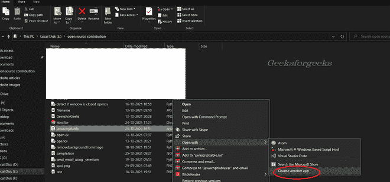
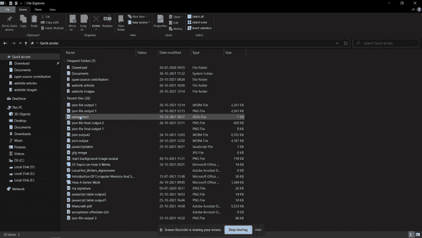
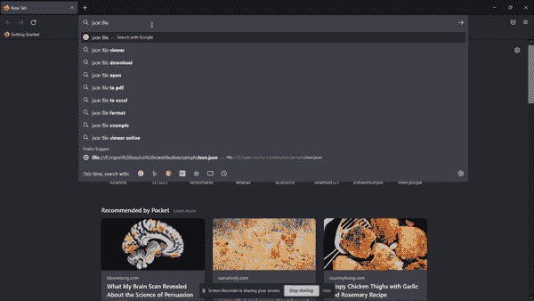

# 如何打开 json 文件？

> 原文:[https://www.geeksforgeeks.org/how-to-open-json-file/](https://www.geeksforgeeks.org/how-to-open-json-file/)

JSON 文件以 JSON 格式存储数据和对象。JSON ( [JavaScript](https://www.geeksforgeeks.org/javascript-tutorial/) 对象符号)格式是存储和交换数据的标准格式。最初，JSON 文件仅用于在 web 应用程序和服务器之间交换数据。现在，它被用于许多目的，例如获取和恢复数据备份。

用户可以使用。json 扩展。这是一个简单的基于文本的人类可读文件，我们可以在兼容的文本编辑器中编辑和阅读。JSON 文件不会占用太多空间来存储数据，因为它是一个纯文本文件。

### **如何创建 JSON 文件？**

在我们学会打开 JSON 文件之前，我们需要创建它们。要创建一个示例 JSON 文件，请遵循以下基本步骤。

1.  打开计算机上的文本编辑器。
2.  创建一个新文件并保存它。
3.  用户需要用。json 扩展。
4.  复制下面的示例 JSON 代码并粘贴到文件中，然后再次保存。

【JSON 代码示例:

## java 描述语言

```
/* sample json code */
{
    "firstName": "fname",
    "lastName": "lname",
    "gender": "male",
    "age": 25,
    "address": {
        "streetAddress": "26 colony",
        "city": "Ahemdabad",
        "state": "Gujarat",
        "postalCode": "354323"
    },
    "phoneNumbers": [
        { "type": "business", "number": "9323227323" }
    ]
}
```

### **如何打开 JSON 文件？**

我们已经成功地创建了一个示例 JSON 文件。在本节中，我们将讨论打开 JSON 文件的工具。

**跨平台打开 JSON 文件:**一般用户可以在任何文本编辑器中打开 JSON 文件，因为它是基于纯文本的文件。**谷歌浏览器**和 **Mozilla Firefox** 网络浏览器是跨平台的，可以打开与每个操作系统兼容的 JSON 文件。用户可以按照以下步骤在 Chrome 或 Firefox 浏览器中打开 JSON 文件。

*   右键单击 JSON 文件。
*   从菜单中选择*打开*选项。
*   从下拉菜单中选择 Chrome 或 Firefox。



*   如果找不到 chrome 应用内菜单，点击选择*另一个应用。*在这里，你会发现 chrome 和火狐上市了。

当 JSON 文件在浏览器中打开时，用户将看到以下输出。



但是，用户可以直接复制 JSON 文件的位置路径，并将其复制到浏览器中读取文件。每个操作系统都支持不同的文本编辑器。这里，我们提供了每个操作系统的最佳文本编辑器列表。

<figure class="table">

| **Operating system** | **List of text editors** |
| Windows 操作系统 | Microsoft Notepad, Microsoft Word, VS Code, Atom |
| 苹果个人计算机 | 苹果 TextEdit、Mac VIm |
| Linux 操作系统 | VIm editor, PICO |

</figure>

用户可以使用上表中的任何文本编辑器打开和编辑 JSON 文件。如果用户不想下载任何工具或应用程序来打开 JSON 文件，可以使用在线工具进行编辑。用户应该有一个工作的互联网连接来在线编辑 JSON 文件。

**在线编辑 JSON 文件**

*   打开任何浏览器，搜索“在线 JSON 编辑器”。
*   点击结果中的第一个链接。



*   JSON 编辑器是打开的，您可以从本地计算机读取文件。您还可以编辑 JSON 文件，并将其保存在本地或云中。
*   像这样的在线工具让你不必下载离线工具。