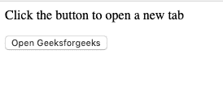
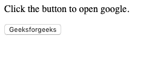

# 如何用 JavaScript 在新标签页打开 URL？

> 原文:[https://www . geesforgeks . org/how-open-URL-in-new-tab-using-JavaScript/](https://www.geeksforgeeks.org/how-to-open-url-in-new-tab-using-javascript/)

在 HTML 中，锚点标签用于以一种简单明了的方式在新标签中打开网址。关于这个标签的更多信息可以从[这篇文章](https://www.geeksforgeeks.org/html-links/)中了解到。然而，有时需要使用 Javascript 来做同样的事情。在这种情况下 **window.open()方法**证明是有帮助的。 **window.open()方法**用于根据浏览器设置和参数值打开新的浏览器窗口或新的选项卡。

**进场:**

*   要打开一个新的选项卡，我们必须在 window.open()的第二个参数中使用 _blank。
*   window.open()的返回值是对新创建的窗口或选项卡的引用，如果失败则为 null。
*   不要向其中添加第三个参数，因为这将导致打开一个新窗口，而不是选项卡

**语法:**

```
window.open(URL, '_blank'); 
```

**例 1:**

```
<html>

<body>

    <p>Click the button to open a new tab </p>

    <button onclick="NewTab()">
      Open Geeksforgeeks
  </button>

    <script>
        function NewTab() {
            window.open(
              "https://www.geeksforgeeks.org", "_blank");
        }
    </script>

</body>

</html>
```

**输出:**


**例 2:**

```
<html>

<body>

    <p>Click the button to open google.</p>

    <button onclick="Open()">Geeksforgeeks</button>

    <script>
        function Open() {
            window.open("https://www.google.com", "_blank");
        }
    </script>

</body>

</html>
```

**输出:**


JavaScript 最出名的是网页开发，但它也用于各种非浏览器环境。您可以通过以下 [JavaScript 教程](https://www.geeksforgeeks.org/javascript-tutorial/)和 [JavaScript 示例](https://www.geeksforgeeks.org/javascript-examples/)从头开始学习 JavaScript。