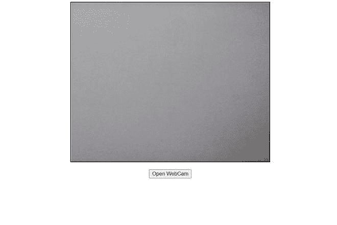

# 如何用 JavaScript 打开网络摄像头？

> 原文:[https://www . geesforgeks . org/how-open-web-cam-in-JavaScript/](https://www.geeksforgeeks.org/how-to-open-web-cam-in-javascript/)

在本文中，我们将看到如何使用 JavaScript 打开网络摄像头并显示实时视频。为此，我们将使用导航媒体设备。

**导航器媒体设备:**它是一个只读属性，返回一个 Media Devices 对象，帮助我们访问连接的媒体输入设备，如摄像头和麦克风。

**语法:**

```html
var mediaDevices = navigator.mediaDevices;
```

**示例:**

## 超文本标记语言

```html
<!DOCTYPE html>
<html lang="en">
  <head>
    <meta charset="UTF-8" />
    <meta http-equiv="X-UA-Compatible" content="IE=edge" />
    <meta name="viewport" 
          content="width=device-width, initial-scale=1.0" />
    <title>Web Cam</title>
    <script>
      document.addEventListener("DOMContentLoaded", () => {
        var but = document.getElementById("but");
        var video = document.getElementById("vid");
        var mediaDevices = navigator.mediaDevices;
        vid.muted = true;
        but.addEventListener("click", () => {

          // Accessing the user camera and video.
          mediaDevices
            .getUserMedia({
              video: true,
              audio: true,
            })
            .then((stream) => {

              // Changing the source of video to current stream.
              video.srcObject = stream;
              video.addEventListener("loadedmetadata", () => {
                video.play();
              });
            })
            .catch(alert);
        });
      });
    </script>
  </head>

  <style>
    div {
      width: 500px;
      height: 400px;
      border: 2px solid black;
      position: relative;
    }
    video {
      width: 500px;
      height: 400px;
      object-fit: cover;
    }
  </style>

  <body>
    <center>
      <div>
        <video id="vid"></video>
      </div>
      <br />
      <button id="but" autoplay>
        Open WebCam
      </button>
    </center>
  </body>
</html>
```

**输出:**

*   **点击按钮前:**

    

*   **点击按钮后:**

    