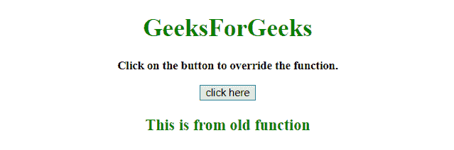
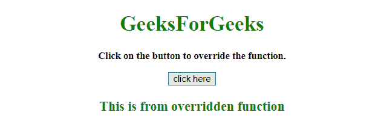
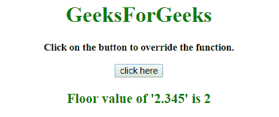

# 如何覆盖一个 JavaScript 函数？

> 原文:[https://www . geesforgeks . org/how-override-a-JavaScript-function/](https://www.geeksforgeeks.org/how-to-override-a-javascript-function/)

给定一个 HTML 文档，任务是覆盖函数，或者是预定义函数，或者是使用 JavaScript 的用户定义函数。

**方法:**当我们运行脚本时，Fun()函数被调用。点击按钮后，调用 **GFG_Fun()** 函数，该函数包含另一个将要运行的函数。

**示例 1:** 在本例中，用户编写的函数是 override。

```
<!DOCTYPE HTML> 
<html> 

<head> 
    <title> 
        How to override a JavaScript function ?
    </title>
</head>

<body style = "text-align:center;"> 

    <h1 style = "color:green;" id = "h1"> 
        GeeksForGeeks 
    </h1>

    <p id = "GFG_UP" style =
        "font-size: 15px; font-weight: bold;">
    </p>

    <button onclick = "GFG_Fun()">
        click here
    </button>

    <p id = "GFG_DOWN" style = 
        "color:green; font-size: 20px; font-weight: bold;">
    </p>

    <script> 
        var up = document.getElementById('GFG_UP');     
        up.innerHTML = "Click on the button to override"
                    + " the function.";

        var down = document.getElementById('GFG_DOWN');

        function Fun() {
            return "This is from old function";
        }

        down.innerHTML = Fun();

        function GFG_Fun() {
            var newFun = Fun;
            Fun = function() {
                return "This is from overridden function";
            }
            down.innerHTML = Fun();
        }
    </script> 
</body> 

</html>
```

**输出:**

*   **点击按钮前:**
    
*   **点击按钮后:**
    

**示例 2:** 在本例中，**解析浮动**方法被覆盖。

```
<!DOCTYPE HTML> 
<html> 

<head> 
    <title> 
        How to override a JavaScript function ?
    </title>
</head>

<body style = "text-align:center;"> 

    <h1 style = "color:green;" id = "h1"> 
        GeeksForGeeks 
    </h1>

    <p id = "GFG_UP" style = 
        "font-size: 15px; font-weight: bold;">
    </p>

    <button onclick = "GFG_Fun()">
        click here
    </button>

    <p id = "GFG_DOWN" style = 
        "color:green; font-size: 20px; font-weight: bold;">
    </p>

    <script> 
        var up = document.getElementById('GFG_UP');     

        up.innerHTML = "Click on the button to override"
                    + " the function.";

        var down = document.getElementById('GFG_DOWN');

        down.innerHTML = "Floor value of '2.345' is ";

        function GFG_Fun() {

            // Override
            parseFloat = function(x) {
                return "Floor value of '2.345' is "
                            + Math.floor(x);
            }

            // Overriding the parseFloat function and
            // use it as Math.floor
            down.innerHTML = parseFloat(2.345); 
        }
    </script> 
</body> 

</html>
```

**输出:**

*   **点击按钮前:**
    
*   **点击按钮后:**
    