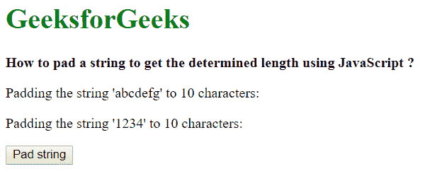
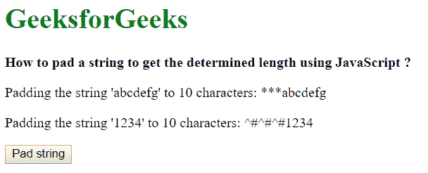

# 如何用 JavaScript 填充字符串得到确定的长度？

> 原文:[https://www . geesforgeks . org/如何使用 javascript 填充字符串以获得确定的长度/](https://www.geeksforgeeks.org/how-to-pad-a-string-to-get-the-determined-length-using-javascript/)

**方法 1:使用 padStart()方法:**pad start()方法可用于将具有指定字符的字符串填充到指定长度。它需要两个参数，目标长度和要替换的字符串。目标长度是填充当前字符串后的结果字符串长度。第二个参数是字符串要填充的字符。

如果要填充一个数字，首先必须通过将它传递给字符串构造函数将其转换为字符串。然后在这个字符串上使用 padStart()方法。

**语法:**

```
String(strToPad).padStart(padLength, padChar)
```

**示例:**

```
<!DOCTYPE html>
<html>

<head>
    <title>
        How to pad a string to get the determined
        length using JavaScript ?
    </title>
</head>

<body>
    <h1 style="color: green">GeeksforGeeks</h1>

    <b> 
        How to pad a string to get the determined
        length using JavaScript ?
    </b>

    <p>
        Padding the string 'abcdefg' to 10 characters:
        <span class="output"></span>
    </p>

    <p>
        Padding the string '1234' to 10 characters:
        <span class="output-2"></span>
    </p>

    <button onclick="pad()">Pad string</button>

    <script type="text/javascript">

        function pad() {
            example1 = "abcdefg";
            example2 = 1234;

            prepended_out = String(example1).padStart(10, '*');
            prepended_out2 = String(example2).padStart(10, '^#');

            document.querySelector('.output').textContent
                    = prepended_out;

            document.querySelector('.output-2').textContent
                    = prepended_out2;
        }
    </script>
</body>

</html>                    
```

**输出:**

*   **点击按钮前:**
    
*   **点击按钮后:**
    

**方法 2:使用 repeat()和 slice()方法的自定义函数:**该函数必须用三个参数创建，即要填充的字符、最终填充字符串的长度和要填充的字符串。

要填充的字符和要填充的字符串首先转换为字符串。这是通过使用 String()构造函数并将两个值都传递给它来实现的。这些存储在两个变量中， *padChar* 和 *originalString* 。要填充的实际字符数是通过用要填充的字符长度减去所需的字符串长度来确定的。这存储在一个新的变量中， *padLeft* 。
在原始字符串前面添加的填充字符串是使用 repeat()方法创建的。repeat()方法返回一个新字符串，该字符串包含调用它的字符串的指定数量的副本。它接受一个参数，即要制作的副本数量。在 *padChar* 字符串上调用该方法，并且在该参数中传递 *padLeft* 值。它创建需要添加到原始字符串前面的字符串的副本。这存储在变量 *padString* 中。
通过连接*焊盘字符串*和*原始字符串*来创建新字符串。对这个新字符串使用 slice()方法，使长度等于所需的长度。这是通过传递 padLength 的负值来实现的。然后返回最后一个字符串。

**示例:**

```
<!DOCTYPE html>
<html>

<head>
    <title>
        How to pad a string to get the determined
        length using JavaScript ?
    </title>
</head>

<body>
    <h1 style="color: green">GeeksforGeeks</h1>

    <b> 
        How to pad a string to get the determined
        length using JavaScript ?
    </b>

    <p>
        Padding the string 'abcdefg' to 10 characters:
        <span class="output"></span>
    </p>

    <p>
        Padding the string '1234' to 10 characters:
        <span class="output-2"></span>
    </p>

    <button onclick="pad()">Pad string</button>

    <script type="text/javascript">

        function padStr(padChar, padLength, originalString) {

            // Convert the pad character and original
            // string to String
            padChar = String(padChar);
            originalString = String(originalString);

            // Calculate the length of padding characters
            padLeft = padLength - originalString.length;

            // Create the pad string
            padString = padChar.repeat(padLeft);

            // Add the pad string to the original string
            // slice it to the padLength if it exceeds
            // the pad length specified
            newString = (padString + 
                        originalString).slice(-padLength);
            return newString;
        }

        function pad() {
            example1 = "abcdefg";
            example2 = 1234;

            prepended_out = padStr('*', 10, example1);
            prepended_out2 = padStr('^#', 10, example2);

            document.querySelector('.output').textContent 
                    = prepended_out;

            document.querySelector('.output-2').textContent
                    = prepended_out2;
        }
    </script>
</body>

</html>
```

**输出:**

*   **点击按钮前:**
    
*   **点击按钮后:**
    