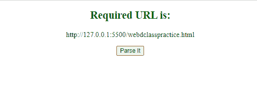
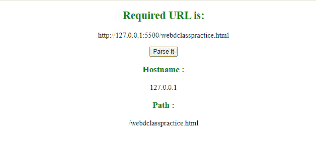
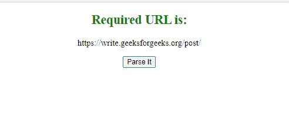
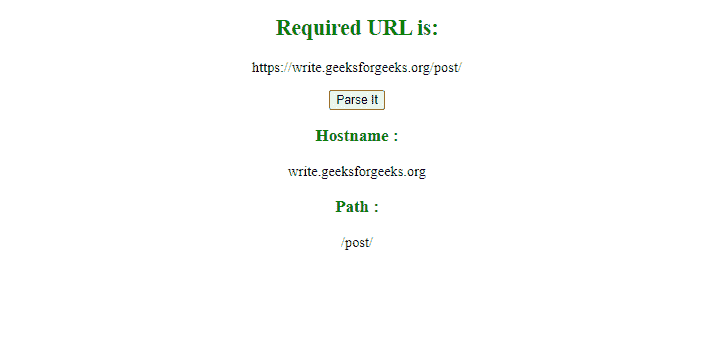

# 如何在 javascript 中将一个 URL 解析为主机名和路径？

> 原文:[https://www . geesforgeks . org/如何将 url 解析为 javascript 中的主机名和路径/](https://www.geeksforgeeks.org/how-to-parse-a-url-into-hostname-and-path-in-javascript/)

## **如何在 JavaScript 中将一个 URL 解析为主机名和路径？**

URL 代表统一资源定位符。我们可以解析一个网址来访问它的组件，这可以通过使用 JavaScript 中的预定义属性来实现。例如，第一个示例解析当前网页的网址，第二个示例解析预定义的网址。

**示例 1:** 这个 示例解析当前网页的 URL。

## 超文本标记语言

```html
<!DOCTYPE html>
<html>

<body style="text-align:center;">
    <h2 style="color:green;">
        Required URL is:
    </h2>

    <p id="para1"></p>

    <button onclick="my_function()">
        Parse It
    </button>

    <p id="para2"></p>

    <p id="para3"></p>

    <!--Script to parse the URL of 
        the current web page-->
    <script>
        document.getElementById("para1")
            .innerHTML = window.location.href;

        function my_function() {
            document.getElementById("para2")
                .innerHTML = 
`<h3 style="color:green;">Hostname : </h3>` +
                window.location.hostname;

            document.getElementById("para3")
                .innerHTML = 
`<h3 style="color:green;">Path : </h3>` +
                window.location.pathname;
        }
    </script>
</body>

</html>
```

**Output:**

**点击按钮前:**



在单击按钮之前

**点击按钮后:**



单击按钮后

**示例 2** 本示例解析预定义的网址。

## 超文本标记语言

```html
<!DOCTYPE html>
<html>

<body style="text-align: center;">
    <h2 style="color: green;">
        Required URL is:
    </h2>
    <p id="para1"></p>

    <button onclick="my_function()">
        Parse It
    </button>
    <p id="para2"></p>

    <p id="para3"></p>

    <!--Script to parse predefined URL -->
    <script>
        var my_url = new URL(
"https://write.geeksforgeeks.org/post/");

        document.getElementById("para1")
                .innerHTML = my_url;

        function my_function() {
            document.getElementById("para2")
                .innerHTML = 
`<h3 style="color:green;">Hostname : </h3>`
                + my_url.hostname;

            document.getElementById("para3")
                .innerHTML = 
`<h3 style="color:green;">Path : </h3>`
                + my_url.pathname;
        }
    </script>
</body>

</html>
```

**Output:**

**点击按钮前:**



在点击按钮之前

**点击按钮后:**



点击按钮后