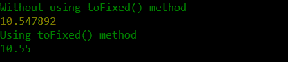
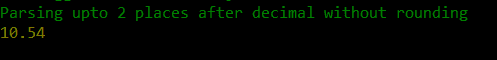

# 如何解析 JavaScript 中小数点后两位的浮点数？

> 原文:[https://www . geeksforgeeks . org/如何解析带小数点的浮点型 javascript/](https://www.geeksforgeeks.org/how-to-parse-float-with-two-decimal-places-in-javascript/)

JavaScript 是一种高级、动态类型化和解释的客户端脚本语言。JavaScript 提供了一个内置的 [**parseFloat()**](https://www.geeksforgeeks.org/javascript-parsefloat-function/) 方法来解析一个字符串并返回一个浮点数。

**parseFloat()** 方法检查字符串的第一个字符是否是数字，如果是数字，该方法分析字符串直到结束。如果字符串的第一个字符不是数字，则 **parseFloat()** 返回 **NaN** (不是数字)。 **parseFloat()** 方法解析整个字符串。如果传递的字符串在小数点后有 5 位，那么输出是一个在小数点后有 5 位的浮点数。要将小数后的位数限制为 2 位，请使用 [**toFixed()**](https://www.geeksforgeeks.org/javascript-tofixed-function/) 方法。 **toFixed()** 方法将浮点数向上舍入到小数点后 2 位。

**语法:**

```
parseFloat(string) 
```

**参数:**

*   **字符串:**要解析的字符串格式的浮点数。

**返回值:**如果字符串的第一个字符是数字，则返回解析后的浮点数，否则返回 NaN。

**语法:**

```
toFixed( int )
```

**参数**

*   **int:** 小数点后必须解析字符串的位数。

**返回值:**返回四舍五入到小数点后指定位置的数字或字符串。如果指定的值大于实际字符串中小数点后的位数，则结果值用 0 填充，以保持最终输出中小数点后的位数。

**例 1:**

## java 描述语言

```
var num1 = parseFloat("10.547892")
var num2 = parseFloat("10.547892").toFixed(2)
console.log("Without using toFixed() method");
console.log(num1);
console.log("Using toFixed() method");
console.log(num2);
```

**输出:**



**示例 2:** 上面的示例将数字向上舍入到小数点后 2 位。但是在某些情况下，开发人员可能不想四舍五入。这是一种不用舍入就能得到指定位置的浮点数的替代方法。

在这个例子中，定义了一个函数 *ParseFloat()* ，它接受 2 个参数。第一个参数是要解析的字符串或数字，第二个参数是小数点后的位数。

**方法:**首先，将第一个参数转换为字符串，如果传递的参数不是字符串格式，这将有所帮助。现在，字符串从开始到小数点后指定的位数被分割。最后，在将类型转换为数字后，返回切片字符串。此方法的局限性在于，与 *parseFloat()不同，*此方法无法检测传递的字符串是否实际包含浮点数。

**示例:**

## java 描述语言

```
function ParseFloat(str,val) {
    str = str.toString();
    str = str.slice(0, (str.indexOf(".")) + val + 1); 
    return Number(str);   
}
console.log(ParseFloat("10.547892",2))
```

**输出:**



JavaScript 最出名的是网页开发，但它也用于各种非浏览器环境。您可以通过以下 [JavaScript 教程](https://www.geeksforgeeks.org/javascript-tutorial/)和 [JavaScript 示例](https://www.geeksforgeeks.org/javascript-examples/)从头开始学习 JavaScript。