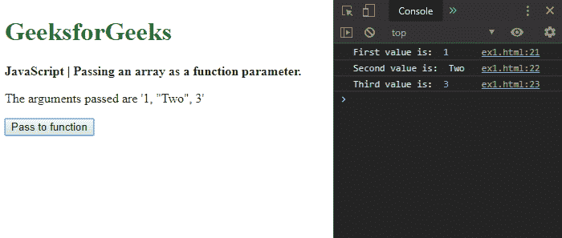
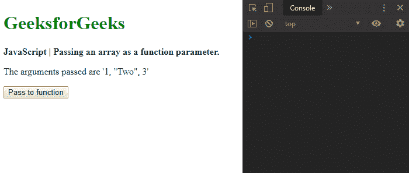
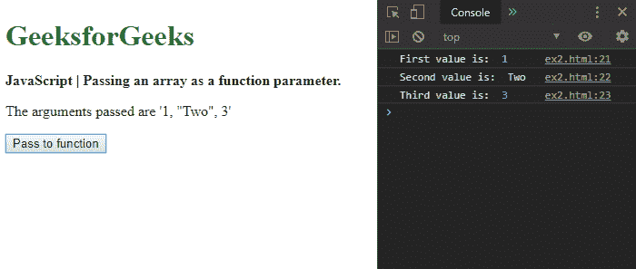

# 如何在 JavaScript 中将数组作为函数参数传递？

> 原文:[https://www . geesforgeks . org/如何将数组作为函数参数传递给 javascript/](https://www.geeksforgeeks.org/how-to-pass-an-array-as-a-function-parameter-in-javascript/)

**方法 1:使用 apply()方法:**使用 **apply()** 方法调用带有给定参数的函数作为数组或类似数组的对象。它包含两个参数。*这个*值提供了对函数的调用，参数数组包含要传递的参数数组。

apply()方法用于必须作为参数数组传递的函数。第一个参数被指定为“null ”,第二个参数用参数数组指定。这将调用具有指定参数数组的函数。

**语法:**

```
arrayToPass = [1, "Two", 3];

unmodifiableFunction.apply(null, arrayToPass);
```

**示例:**

```
<!DOCTYPE html>
<html>

<head>
    <title>
        How to pass an array as a function
        parameter in JavaScript ?
    </title>
</head>

<body>
    <h1 style="color: green">
        GeeksforGeeks
    </h1>

    <b>
        JavaScript | Passing an array
        as a function parameter.
    </b>

    <p>
        The arguments passed
        are '1, "Two", 3'
    </p>

    <button onclick="passToFunction()">
        Pass to function
    </button>

    <script type="text/javascript">

        function passToFunction() {
            arrayToPass = [1, "Two", 3];

            unmodifiableFunction.apply(null, arrayToPass);
        }

        function unmodifiableFunction(a, b, c) {
            console.log("First value is: ", a);
            console.log("Second value is: ", b);
            console.log("Third value is: ", c);
        }
    </script>
</body>

</html>
```

**输出:**

*   **点击按钮前:**
    
*   **点击按钮后:**
    

**方法 2:使用扩展语法:**扩展语法用于预期零个或多个参数的地方。它可以与迭代器一起使用，迭代器在可能没有固定数量的预期参数(如函数参数)的地方进行扩展。

在给定参数数组的情况下，使用扩展语法调用所需的函数，以便它可以从数组中填充函数的参数。

**语法:**

```
arrayToPass = [1, "Two", 3];

unmodifiableFunction(...arrayToPass);
```

**示例:**

```
<!DOCTYPE html>
<html>

<head>
    <title>
        How to pass an array as a function
        parameter in JavaScript ?
    </title>
</head>

<body>
    <h1 style="color: green">
        GeeksforGeeks
    </h1>

    <b>
        JavaScript | Passing an array
        as a function parameter.
    </b>

    <p>
        The arguments passed
        are '1, "Two", 3'
    </p>

    <button onclick="passToFunction()">
        Pass to function
    </button>

    <script type="text/javascript">

        function passToFunction() {
            arrayToPass = [1, "Two", 3];

            unmodifiableFunction(...arrayToPass);
        }

        function unmodifiableFunction(a, b, c) {
            console.log("First value is: ", a);
            console.log("Second value is: ", b);
            console.log("Third value is: ", c);
        }
    </script>
</body>

</html>
```

**输出:**

*   **点击按钮前:**
    
*   **点击按钮后:**
    