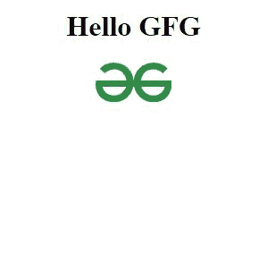

# 如何在 JavaScript 函数中将 Image 作为参数传递？

> 原文:[https://www . geesforgeks . org/如何将图像作为 javascript 函数中的参数传递/](https://www.geeksforgeeks.org/how-to-pass-image-as-a-parameter-in-javascript-function/)

我们都熟悉函数及其参数，我们经常在 JavaScript 函数中使用字符串、整数、对象、数组作为参数，但现在将看到如何在 JavaScript 函数中将图像作为参数传递。我们将在这里使用普通的 JavaScript。

首先，创建一个接收参数的函数，然后调用该函数。参数应该是一个字符串，表示图像的位置。

**语法:**

```
function displayImage (picUrl) {
    ...
}

displayImage('/assets/myPicture.jpg')

```

**示例:**在本例中，我们将在 id 为“imgDiv”的 DIV 中显示一个图像。

```
<div id="imgDiv">
    <!-- Here we show the picture -->
</div>

```

**步骤:**

1.  首先，创建一个标记，该标记有一个 **h1** 和一个 **div** 标签，其 id 为 **imgDiv** ，我们将在其中插入图像。
2.  创建一个脚本标签，在这个标签中，我们所有人都将制作我们所有的逻辑。
3.  创建一个名为 **divLocation** 的变量，并将该 div 的 DOM 元素赋给该变量。
4.  现在用 **document.createElement()** 创建一个 img 元素，并将其分配到变量 img element 中。
5.  然后通过**使用 imgelelement . href =/image location/**将图像的 URL 分配给它的 href 属性。
6.  现在通过 **追加()** 方法将 img 元素追加到 div 元素中。

```
<!DOCTYPE html>
<html>

<body>
    <center>
        <h1>Hello GFG</h1>
        <div id="imgDiv"></div>
    </center>

    <script>
        var Pic = ""

        function displayImage(pic) {
            let divLocation = document.getElementById("imgDiv");
            let imgElement = document.createElement("img");
            imgElement.src = pic
            divLocation.append(imgElement);
        }

        Pic = 
"https://write.geeksforgeeks.org/static/media/Group%20210.08204759.svg";

        displayImage(Pic);
    </script>
</body>

</html>
```

**输出:**
