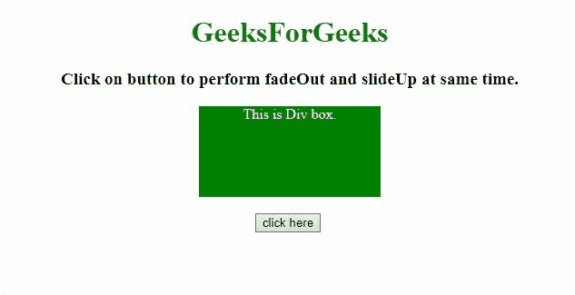
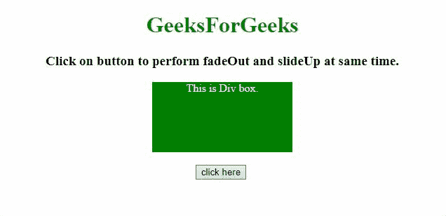

# 如何在 JavaScript 中一起执行 fadeOut()和 slideUp()？

> 原文:[https://www . geesforgeks . org/如何在 javascript 中执行淡出和向上滑动/](https://www.geeksforgeeks.org/how-to-perform-fadeout-and-slideup-together-in-javascript/)

给定一个文档，任务是在 JavaScript 的帮助下同时执行 fadeOut()和 slideUP()。这里讨论两种方法。

**方法 1:**
首先选择元素。使用 [**动画()方法**](https://www.geeksforgeeks.org/jquery-animate-with-examples/) 来执行这两个操作，该方法需要 4 个参数，但在这种情况下只使用了 2 个。首先是我们想要动画化的 CSS，其次是速度。CSS 为{高度:0，不透明度:0}，使用的速度为“慢”。“高度”属性用于执行“向上滑动”效果，而“不透明度”用于执行“淡出”效果。

*   **示例:**该示例实现了上述方法。

    ```
    <!DOCTYPE HTML>
    <html>

    <head>
        <title>
            Perform fadeOut() and slideUp()
          at the same time with JavaScript
        </title>
        <style>
            #div {
                background: green;
                height: 100px;
                width: 200px;
                margin: 0 auto;
                color: white;
            }
        </style>
        <script src=
    "https://ajax.googleapis.com/ajax/libs/jquery/3.4.0/jquery.min.js">
        </script>
    </head>

    <body style="text-align:center;">
        <h1 style="color:green;">  
                GeeksForGeeks  
            </h1>
        <p id="GFG_UP" 
           style="font-size: 19px; font-weight: bold;">
        </p>
        <div id="div">
            This is Div box.
        </div>
        <br>
        <button onClick="GFG_Fun()">
            click here
        </button>
        <br>
        <p id="GFG_DOWN" 
           style="color: green; 
                  font-size: 24px; 
                  font-weight: bold;">
        </p>
        <script>
            $('#GFG_UP').text(
              "Click on button to perform fadeOut and slideUp at same time.");

            function GFG_Fun() {
                $("#div").animate({
                    height: 0,
                    opacity: 0
                }, 'slow');
                $('#GFG_DOWN').text(
                  "Both operations performed simultaneously.");
            }
        </script>
    </body>

    </html>
    ```

*   **输出:**
    

**方法 2:**
首先选择元素。使用 来执行这两个操作，该方法需要 4 个参数，但在本例中只使用了 2 个。首先是我们想要动画化的 CSS，其次是速度。CSS 是{ height: 'toggle '，不透明度:' toggle'}，使用的速度是' slow '。“高度”属性用于执行“向上滑动”效果，而“不透明度”用于执行“淡出”效果。这个例子也可以逆转这种效果。

*   **示例:**该示例实现了上述方法。

    ```
    <!DOCTYPE HTML>
    <html>

    <head>
        <title>
            Perform fadeOut() and slideUp() 
          at the same time with JavaScript
        </title>
        <style>
            #div {
                background: green;
                height: 100px;
                width: 200px;
                margin: 0 auto;
                color: white;
            }
        </style>
        <script src=
    "https://ajax.googleapis.com/ajax/libs/jquery/3.4.0/jquery.min.js">
        </script>
    </head>

    <body style="text-align:center;">
        <h1 style="color:green;">  
                GeeksForGeeks  
            </h1>
        <p id="GFG_UP" 
           style="font-size: 19px;
                  font-weight: bold;">
        </p>
        <div id="div">
            This is Div box.
        </div>
        <br>
        <button onClick="GFG_Fun()">
            click here
        </button>
        <br>
        <p id="GFG_DOWN" 
           style="color: green; 
                  font-size: 24px; 
                  font-weight: bold;">
        </p>
        <script>
            $('#GFG_UP').text(
           "Click on button to perform fadeOut and slideUp at same time.");

            function GFG_Fun() {
                $("#div").animate({
                    height: 'toggle',
                    opacity: 'toggle'
                }, 'slow');
                $('#GFG_DOWN').text(
               "Both operations performed simultaneously.");
            }
        </script>
    </body>

    </html>
    ```

*   **输出:**
    