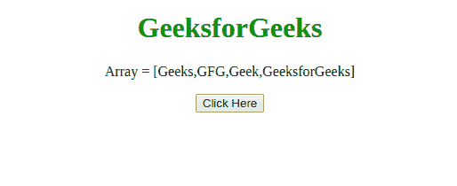

# 在 JavaScript 中不使用 un`shift()`方法如何进行 unshift 操作？

> 原文:[https://www . geeksforgeeks . org/如何执行-unshift-operation-无需使用-unshift-method-in-JavaScript/](https://www.geeksforgeeks.org/how-to-perform-unshift-operation-without-using-unshift-method-in-javascript/)

任务是在 jQuery 的帮助下，不使用 [**un`shift()`方法**](https://www.geeksforgeeks.org/javascript-array-prototype-unshift-function/) 执行 unshift 操作。下面讨论两种方法:

**方法 1:** 我们可以使用 [**数组 concat()方法**](https://www.geeksforgeeks.org/javascript-array-prototype-concat-function/) ，该方法用于连接两个或多个数组。只需将新元素作为大小为 1 的数组和数组的其余部分传递。

*   **例:**

    ```html
    <!DOCTYPE HTML>
    <html>

    <head>
        <title>
            How to perform the unshift() operation 
            without using it in JavaScript
        </title>
    </head>

    <body style="text-align:center;">
        <h1 style="color:green;"> 
                GeeksforGeeks 
        </h1>
        <p id="GFG_UP">
        </p>
        <button onclick="myGFG()">
            Click Here
        </button>
        <p id="GFG_DOWN">
        </p>
        <script>
            var array = ['Geeks', 'GFG', 'Geek', 'GeeksforGeeks'];
            var up = document.getElementById("GFG_UP");
            up.innerHTML = "Array = [" + array + "]";
            var down = document.getElementById("GFG_DOWN");

            function myGFG() {
                var newElement = 'gfg';
                newArray = [newElement].concat(array);
                down.innerHTML = "Elements of array = ["
                                  + newArray + "]";
            }
        </script>
    </body>

    </html>
    ```

*   **输出:** 

**方法二:**我们可以使用 [**ES6 展开符**](https://www.geeksforgeeks.org/javascript-spread-operator/) 来执行操作。

*   **例:**

    ```html
    <!DOCTYPE HTML>
    <html>

    <head>
        <title>
            How to perform the unshift() operation without 
            using it in JavaScript
        </title>
    </head>

    <body style="text-align:center;">
        <h1 style="color:green;"> 
                GeeksforGeeks 
        </h1>
        <p id="GFG_UP">
        </p>
        <button onclick="myGFG()">
            Click Here
        </button>
        <p id="GFG_DOWN">
        </p>
        <script>
            var array = ['Geeks', 'GFG', 'Geek', 'GeeksforGeeks'];
            var up = document.getElementById("GFG_UP");
            up.innerHTML = "Array = [" + array + "]";
            var down = document.getElementById("GFG_DOWN");

            function myGFG() {
                var newElement = 'gfg';
                newArray = [newElement, ...array];
                down.innerHTML = "elements of array = ["
                                + newArray + "]";
            }
        </script>
    </body>

    </html>
    ```

*   **输出:**
    