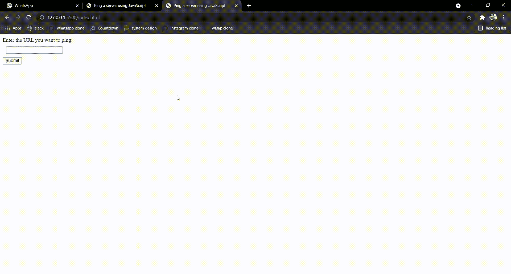

# 如何用 JavaScript ping 服务器？

> 原文:[https://www . geesforgeks . org/如何使用 JavaScript ping 通服务器/](https://www.geeksforgeeks.org/how-to-ping-a-server-using-javascript/)

ping 服务器用于确定它是否在线。这个想法是向服务器发送一条回显消息(称为 ping)，然后服务器会用一条类似的消息(称为 pong)进行回复。Ping 消息通过使用 ICMP(互联网控制消息协议)来发送和接收。ping 时间越短，主机和服务器之间的连接就越强。

**方法:**一个显而易见的方法是使用命令提示符向服务器发送 ping 消息。详见[本](https://www.geeksforgeeks.org/ping-command-in-linux-with-examples/)帖。在本文中，我们将使用 Ajax 向所需的服务器发送请求，然后检查收到的状态代码，以了解服务器是否正在运行。这个想法是，如果一个服务器返回一个状态代码 200，那么它肯定是启动并运行的。其他状态代码，如 400 等。指向可能的服务器故障。

**下面是分步实施:**

**第一步:**创建一个名为“**index.html**的文件来设计基本网页。当用户点击网页上的按钮时，会调用函数“pingURL”。

## 超文本标记语言

```
<!DOCTYPE html>
<html lang="en">

<head>
    <meta charset="UTF-8">
    <meta http-equiv="X-UA-Compatible" content="IE=edge">
    <meta name="viewport" content=
        "width=device-width, initial-scale=1.0">
    <script src="index.js"></script>
    <script type="text/javascript" src=
        "https://code.jquery.com/jquery-1.7.1.min.js">
    </script>
    <title>Ping a server using JavaScript</title>
</head>

<body>
    <label for="url">
        Enter the URL you want to ping:
    </label><br>

    <input type="text" id="url" 
        name="url" style="margin: 10px;"><br>

        <input type="submit" value="Submit" 
            onclick="pingURL()">
</body>

</html>
```

**步骤 2:** 创建“ **index.js** 文件，向服务器发出请求。“pingURL”函数在“设置”变量中定义了 Ajax 请求所需的配置。

## index.js

```
function pingURL() {

  // The custom URL entered by user
  var URL = $("#url").val();
  var settings = {

    // Defines the configurations
    // for the request
    cache: false,
    dataType: "jsonp",
    async: true,
    crossDomain: true,
    url: URL,
    method: "GET",
    headers: {
      accept: "application/json",
      "Access-Control-Allow-Origin": "*",
    },

    // Defines the response to be made
    // for certain status codes
    statusCode: {
      200: function (response) {
        console.log("Status 200: Page is up!");
      },
      400: function (response) {
        console.log("Status 400: Page is down.");
      },
      0: function (response) {
        console.log("Status 0: Page is down.");
      },
    },
  };

  // Sends the request and observes the response
  $.ajax(settings).done(function (response) {
    console.log(response);
  });
}
```

### 输出

1.  在网络浏览器中打开网页。
2.  按下“ **Ctrl+Shift+I** ”导航至浏览器开发工具。
3.  在表单输入中输入您希望 ping 的网址，然后单击“提交”按钮。

