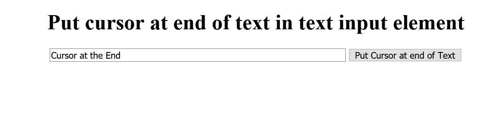
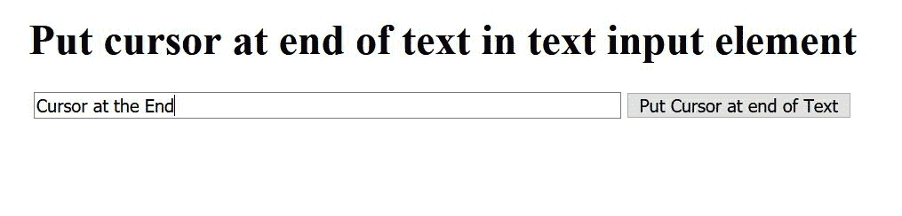

# 如何用 JavaScript 将光标位置放在文本输入栏的文本末尾？

> 原文:[https://www . geesforgeks . org/how-to-place-cursor-position-in-text-in-text-input-field-use-JavaScript/](https://www.geeksforgeeks.org/how-to-place-cursor-position-at-end-of-text-in-text-input-field-using-javascript/)

在本文中，我们将学习如何使用 JavaScript 将光标放在文本输入元素的文本末尾。

首先，我们将创建一个文本输入框，其中将给出一些值，并在末尾放置一个光标按钮。我们可以使用不同的 JavaScript 函数，将光标放在文本输入元素的文本末尾。

**进场:**

使用的 JavaScript 函数有:

*   ***html inputrement . setselectionrange()***:*html inputrement . setselectionrange()*是在<输入>或<文本区域>元素中设置当前文本选择的开始和结束位置的方法。
*   ***element . createtextrange()***:它在输入表单中为我们提供了一个选中的文本范围。插入符号也称为文本光标，它是屏幕上指示文本插入位置的指示器。
*   ***文本范围.折叠()*** :将插入符号移动到当前范围的开头或结尾会有所帮助。
*   ***textrange . move end()***:将范围末端移动指定数量的单位很有帮助。
*   ***TextRange . moveStart()**:*它将范围的起点移动指定数量的单位。

**示例:**

## 超文本标记语言

```html
<!DOCTYPE html>
<html>

<body>
    <center>
        <h1>Put Cursor at End of Input</h1>

        <!-- Creating an Input Text Box and 
            the button to move cursor at the 
            end of the text-->
        <input id="idText" type="text" size="70" 
            value="Cursor at the End">

        <button onclick="PosEnd(idText);">
            Put Cursor at end of Text
        </button>
    </center>

    <script>

        /* Creating a function called PosEnd
         in JavaScript to place the cursor 
         at the end */
        function PosEnd(end) {
            var len = end.value.length;

            // Mostly for Web Browsers
            if (end.setSelectionRange) {
                end.focus();
                end.setSelectionRange(len, len);
            } else if (end.createTextRange) {
                var t = end.createTextRange();
                t.collapse(true);
                t.moveEnd('character', len);
                t.moveStart('character', len);
                t.select();
            }
        }
    </script>
</body>

</html>
```

**输出:**

*   **点击按钮前:** 
*   **点击按钮后:** 