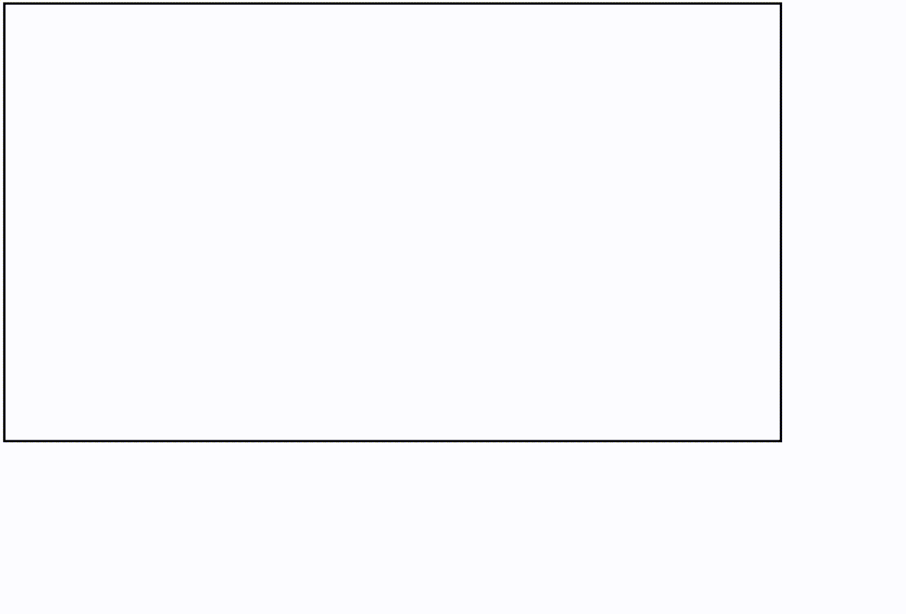

# 如何使用 JavaScript 在鼠标悬停和鼠标悬停暂停时播放视频？

> 原文:[https://www . geesforgeks . org/how-play-video-on-mouse out-how-on-how-鼠标悬停-暂停-使用-javascript/](https://www.geeksforgeeks.org/how-to-play-video-on-mouse-hover-and-pause-on-mouseout-using-javascript/)

在本文中，我们将学习如何在鼠标悬停在视频上时播放视频，以及如何在鼠标从视频元素中移除时停止视频。有时，我们需要当用户将鼠标放在网站上时，网站上的视频自动开始播放，因为它减少了用户在网站上的点击次数，并给用户带来了良好的体验。因此，为了达到这个目的，我们使用 javascript，当鼠标悬停在它上面时，它可以播放，当鼠标出来时，它会自动停止播放。

**方法:**首先，我们将一个视频文件附加到我们的 HTML DOM，然后使用 javascript 在其上应用 mouseover 和 mouseout 事件侦听器。下面是完整的代码实现:

**示例:**在本例中，我们将使用纯 javascript 播放视频。

## 超文本标记语言

```html
<!DOCTYPE html>
<html lang="en">

<head>
    <meta charset="UTF-8">
    <meta http-equiv="X-UA-Compatible"
        content="IE=edge">
    <meta name="viewport" content=
        "width=device-width, initial-scale=1.0">
</head>

<body>

    <!-- Video element -->
    <video src=
"https://media.geeksforgeeks.org/wp-content/uploads/20210810214359/2.mp4"
        type="video/mp4" muted class="vid" 
        loop style="border: solid; width: 800px;">
    </video>

    <script>

        // Targeting video element 
        let clip = document.querySelector(".vid")

        /* Applying mouseover event on video clip 
        and then we call play() function to play 
        the video when the mouse is over the video */
        clip.addEventListener("mouseover", function (e) {
            clip.play();
        })

        /* Applying mouseout event on video clip 
        and then we call pause() function to stop 
        the video when the mouse is out the video */
        clip.addEventListener("mouseout", function (e) {
            clip.pause();
        })
    </script>
</body>

</html>
```

### **输出:**



浏览器输出