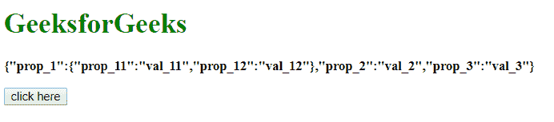
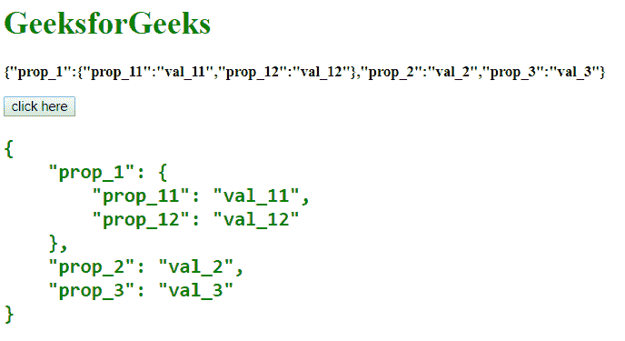
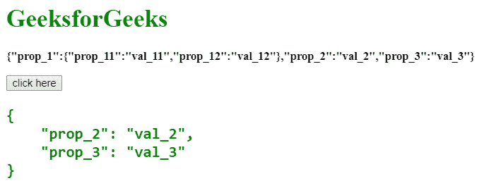

# 如何用 JavaScript 漂亮打印 JSON 字符串？

> 原文:[https://www . geesforgeks . org/how-to-俏丽-print-JSON-string-in-JavaScript/](https://www.geeksforgeeks.org/how-to-pretty-print-json-string-in-javascript/)

给定一个 JavaScript 对象，任务是使用 JavaScript 以非常(易于阅读)的格式打印 JSON 对象。使用

```
元素以漂亮的格式显示对象。
```

**进场:**

*   声明一个 JSON 对象并将其存储到变量中。
*   使用**[JSON . stringify(obj)](https://www.geeksforgeeks.org/javascript-json-stringify-method/)**方法将 JavaScript 对象转换为字符串并显示。
*   使用 **[JSON.stringify(obj，replacer，space)](https://www.geeksforgeeks.org/javascript-json-stringify-method/)** 方法将 JavaScript 对象转换成漂亮格式的字符串。在这个例子中，我们使用四号空间。它以对齐格式显示对象。

**示例 1:** 本示例使用 **[JSON.stringify()方法](https://www.geeksforgeeks.org/javascript-json-stringify-method/)** 打印< pre >标签内的对象元素。

```
<!DOCTYPE html>
<html>

<head>
    <title>
        How to pretty print JSON
        string in JavaScript ?
    </title>
</head>

<body>
    <h1 style="color:green;"> 
        GeeksforGeeks 
    </h1>

    <p id="GFG_UP" style=
        "font-size: 15px; font-weight: bold;">
    </p>

    <button onclick="gfg_Run();">
        click here
    </button>

    <pre id="GFG_DOWN" style=
        "color:green; font-size: 20px; font-weight: bold;">
    </pre>

    <script>
        var el_up = document.getElementById("GFG_UP");
        var el_down = document.getElementById("GFG_DOWN");
        var obj = {
            "prop_1": {
                "prop_11": "val_11",
                "prop_12": "val_12"
            },
            "prop_2": "val_2",
            "prop_3": "val_3"
        };

        el_up.innerHTML = JSON.stringify(obj);

        function gfg_Run() {
            el_down.innerHTML = JSON.stringify(obj, undefined, 4);
        }
    </script>
</body>

</html>                    
```

**输出:**

*   **Before clicking the button:**

    

*   **点击按钮后:**
    

**示例 2:** 这个示例有点类似于上一个示例，但是它指定了打印对象的对象的属性。它还利用 **[JSON.stringify()方法](https://www.geeksforgeeks.org/javascript-json-stringify-method/)** 在< pre >元素内打印一个对象。

```
<!DOCTYPE html>
<html>

<head>
    <title>
        How to pretty print JSON
        string in JavaScript ?
    </title>
</head>

<body>
    <h1 style="color:green;"> 
        GeeksforGeeks 
    </h1>

    <p id="GFG_UP" style=
        "font-size: 15px; font-weight: bold;">
    </p>

    <button onclick="gfg_Run();">
        click here
    </button>

    <pre id="GFG_DOWN" style=
        "color:green; font-size: 20px; font-weight: bold;">
    </pre>

    <script>
        var el_up = document.getElementById("GFG_UP");
        var el_down = document.getElementById("GFG_DOWN");

        var obj = {
            "prop_1": {
                "prop_11": "val_11",
                "prop_12": "val_12"
            },
            "prop_2": "val_2",
            "prop_3": "val_3"
        };

        el_up.innerHTML = JSON.stringify(obj);

        function gfg_Run() {
            el_down.innerHTML = JSON.stringify(obj,
                                ['prop_2', 'prop_3'], 4);
        }
    </script>
</body>

</html>                    
```

**输出:**

*   **点击按钮前:**
    
*   **点击按钮后:**
    

JavaScript 最出名的是网页开发，但它也用于各种非浏览器环境。您可以通过以下 [JavaScript 教程](https://www.geeksforgeeks.org/javascript-tutorial/)和 [JavaScript 示例](https://www.geeksforgeeks.org/javascript-examples/)从头开始学习 JavaScript。