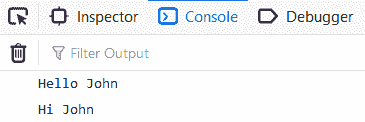
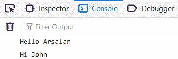

# 如何防止在 JavaScript 中使用假命名空间覆盖？

> 原文:[https://www . geesforgeks . org/如何防止在 javascript 中使用假命名空间来覆盖/](https://www.geeksforgeeks.org/how-to-prevent-overriding-using-fake-namespace-in-javascript/)

重写基本上是当你定义多个同名的函数或变量时，最后一个定义的函数或变量将重写所有先前定义的函数或变量，并且每次当你调用一个函数时，最后一个定义的函数将被执行。当页面中有多个 javascript 文件时，通常会发生重写。它可以是外部文件，也可以是您在内部创建的文件。这通常是因为全局范围内存在同名的变量或函数。

假设我们有以下文件:
**文件名:index.html**

```html
<!DOCTYPE html>
<html>
<head>
    <title>Namespace</title>
    <script src="script1.js"></script>
    <script src="script2.js"></script>
    <script src="app.js"></script>
</head>
<body></body>
</html>
```

该文件将 script1.js、script2.js 和 app.js 链接为外部 javascript 文件，如下所示:
**文件名:script1.js**

```html
var name = "Arsalan";
function sayHello(){
    console.log("Hello "+name);
}
```

**文件名:script2.js**

```html
var name = "John";
function sayHi(){
    console.log("Hi " + name);
}
```

**文件名:app.js**

```html
sayHello();
sayHi();
```

这里 app.js 负责调用 script1.js 和 script2.js 内部的函数，您将在控制台窗口中获得如下输出，如下所示:

嗯，发生这种情况是因为我们在 script1.js 和 script2.js 的全局范围内有相同的变量名。这就是 script2.js 覆盖 script1.js 的原因

为了解决这个问题，我们将使用**命名空间**的概念，如下所述，并对这些文件进行以下更改:

**文件名:index.html**

```html
<!DOCTYPE html>
<html>
<head>
    <title>Namespace</title>
    <script src="script1.js"></script>
    <script src="script2.js"></script>
    <script src="app.js"></script>
</head>
<body></body>
</html>
```

**文件名:script1.js**

```html
var arsalanGreeter = {};
arsalanGreeter.name = "Arsalan";
arsalanGreeter.sayHello = function(){
    console.log("Hello "+ arsalanGreeter.name);
}
```

**文件名:script2.js**

```html
var johnGreeter = {}
johnGreeter.name = "John";
johnGreeter.sayHi = function(){
    console.log("Hi " + johnGreeter.name);
}
```

在上面的两个文件中，我们已经创建了一个对象，然后给 name 变量分配了名称。这样，我们就避免了任何压倒一切的问题。
**文件名:app.js**

```html
arsalanGreeter.sayHello();
johnGreeter.sayHi();
```

在上面的文件中，我们使用了一个新的函数名，它将在运行程序时被调用，您的控制台窗口如下所示:
