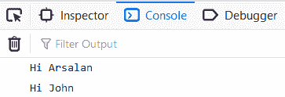
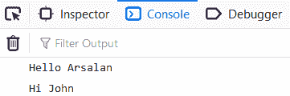

# 如何防止在 JavaScript 中使用立即调用函数表达式覆盖？

> 原文:[https://www . geesforgeks . org/如何防止覆盖-使用-立即调用-函数-表达式-在 javascript 中/](https://www.geeksforgeeks.org/how-to-prevent-overriding-using-immediately-invoked-function-expression-in-javascript/)

重写基本上是当你定义多个同名的函数或变量时，最后一个定义的函数或变量将重写所有先前定义的函数或变量，并且每次当你调用一个函数时，最后一个定义的函数将被执行。当页面中有多个 javascript 文件时，通常会发生重写。它可以是外部文件，也可以是您在内部创建的文件。这通常是因为全局范围内存在同名的变量或函数。

假设我们有以下文件:
**文件名:index.html**

```html
<!DOCTYPE html>
<html>
<head>
    <title>IIFE</title>
    <script src="script1.js"></script>
    <script src="script2.js"></script>
    <script src="app.js"></script>
</head>
<body></body>
</html>
```

该文件将 script1.js、script2.js 和 app.js 链接为外部 javascript 文件，如下所示:

**文件名:script1.js**

```html
var arsalanGreeter = {};
arsalanGreeter.name = "Arsalan";
var greeting = "Hello ";
arsalanGreeter.sayHello = function() {
    console.log(greeting + arsalanGreeter.name);
}
```

**文件名:script2.js**

```html
var johnGreeter = {}
johnGreeter.name = "John";
var greeting = "Hi ";
johnGreeter.sayHi = function() {
    console.log(greeting + johnGreeter.name);
}
```

**文件名:app.js**

```html
arsalanGreeter.sayHello();
johnGreeter.sayHi();
```

这里 app.js 负责调用 script1.js 和 script2.js 内部的函数，你会在你的控制台窗口中得到如下输出，如下所示:

嗯，发生这种情况是因为我们在 script1.js 和 script2.js 中有相同的变量名作为“问候语”。这就是 script2.js 覆盖 script1.js 的原因。

为了解决这个问题，我们将使用**立即调用函数表达式(life)**的概念，如下所述:

现在我们的文件看起来像这样:
**文件名:index.html**

```html
<!DOCTYPE html>
<html>
<head>
    <title>IIFE</title>
    <script src="script1.js"></script>
    <script src="script2.js"></script>
    <script src="app.js"></script>
</head>
<body></body>
</html>
```

**文件名:script1.js**

```html
(function (window) {
   var arsalanGreeter = {};
   arsalanGreeter.name = "Arsalan";
   var greeting = "Hello ";
   arsalanGreeter.sayHello = function() {
       console.log(greeting + arsalanGreeter.name);
   }
   window.arsalanGreeter = arsalanGreeter; 
})(window);
```

**文件名:script2.js**

```html
(function (window) {
   var johnGreeter = {};
   johnGreeter.name = "John";
   var greeting = "Hi ";
   johnGreeter.sayHi = function() {
    console.log(greeting + johnGreeter.name);
   }
   window.johnGreeter = johnGreeter; 
})(window);
```

在上面的两个文件中，我们已经创建了 IIFE 并传递给窗口变量并调用了它。
**文件名:app.js**

```html
arsalanGreeter.sayHello();
johnGreeter.sayHi();
```

做了上面提到的添加立即调用函数表达式的更改后，控制台的输出将如下所示:
