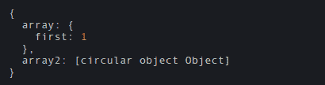
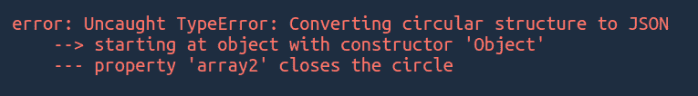
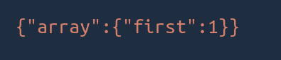
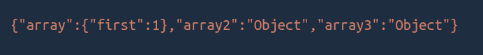

# 如何用 JavaScript 打印类似 JSON 格式的圆形结构？

> 原文:[https://www . geesforgeks . org/how-print-a-circulate-in-a-JSON-like-format-use-JavaScript/](https://www.geeksforgeeks.org/how-to-print-a-circular-structure-in-a-json-like-format-using-javascript/)

循环结构是当你试图引用一个直接或间接引用自己的对象时。

**示例:**

```
A -> B -> A   OR   A -> A
```

开发应用程序时，循环结构非常常见。例如，假设您正在开发一个社交媒体应用程序，其中每个用户可能有一个或多个图像。每个图像都可能引用其所有者。大概是这样的:

```
{
    User1: {
        Image1:{
            URL: 'Image Url',
            Owner: User1 (object)
        },
        Image2:{
            URL: 'Image Url',
            Owner: User1 (object)
        }
    }
}
```

在这里，您可以通过将用户 id 传递给**所有者**而不是用户对象来轻松解决这个问题。

将这些对象传递给 JSON.stringify()会导致**“将循环结构转换为 JSON 错误”**。

让我们举个例子，试着解决这个问题。

**示例:**

## java 描述语言

```
var object = {};
object.array = {'first':1};
object.array2 = object;

console.log(object);
```

输出应该是这样的:



如果我们将上述对象传递给 JSON.stringify()，那么这将导致以下错误:



为了解决这个问题，我们可以将另一个参数传递给 JSON.stringify()，它实际上是一个函数。我们可以在函数中任意处理对象。它需要两个参数，键和被字符串化的值。它为被字符串化的对象或数组上的每个属性调用。它应该返回应该添加到 JSON 字符串中的值。

让我们创建一个名为循环替换器的函数。

```
const circularReplacer = () => {

    // Creating new WeakSet to keep 
    // track of previously seen objects
    const seen = new WeakSet();

    return (key, value) => {
        // If type of value is an 
        // object or value is null
        if (typeof(value) === "object" 
            && value !== null) {

        // If it has been seen before
        if (seen.has(value)) {
                 return;
             }

             // Add current value to the set
             seen.add(value);
       }

       // return the value
       return value;
   };
};
```

**说明:**

*   上面的函数将首先创建一个 WeakSet 来跟踪以前看到的对象。JavaScript 中的 WeakSet 用于存储对象的集合。它采用与集合相同的属性，即不存储副本。在此阅读更多关于 WeakSet [的内容。](https://www.geeksforgeeks.org/javascript-weakset/)
*   检查值的类型是否为对象，并且值不为空。然后检查之前是否见过。如果是，那就返回。如果没有，则将其添加到集合中。
*   而不是在看到对象时什么都不返回。我们可以返回更有用的信息，例如，返回“对象”，它会告诉我们这个值会创建一个循环结构。
*   如果值类型不是对象或值为空。然后简单地返回值。

**例 1:**

## java 描述语言

```
var object = {};
object.array = {'first':1};
object.array2 = object;

const circularReplacer = () => {

    // Creating new WeakSet to keep 
    // track of previously seen objects
    const seen = new WeakSet();

    return (key, value) => {

        // If type of value is an 
        // object or value is null
        if (typeof(value) === "object" 
                   && value !== null) {

        // If it has been seen before
        if (seen.has(value)) {
                 return;
             }

             // Add current value to the set
             seen.add(value);
       }

       // return the value
       return value;
   };
};

var jsonString = JSON.stringify(
         object, circularReplacer());
console.log(jsonString);
```

**输出:**



**注意:**如果我们只是在看到一个圆形结构时返回，那么这个键不会被添加到输出字符串中。

**例 2:** 让我们返回一个字符串，而不是什么都不返回。

## java 描述语言

```
var object = {};
object.array = {'first':1};
object.array2 = object;
object.array3 = object.array2;

const circularReplacer = () => {

    // Creating new WeakSet to keep 
    // track of previously seen objects
    const seen = new WeakSet();

    return (key, value) => {

        // If type of value is an 
        // object or value is null
        if (typeof(value) === "object" 
                  && value !== null) {

        // If it has been seen before
        if (seen.has(value)) {
                 return 'Object';
             }

             // Add current value to the set
             seen.add(value);
       }

       // return the value
       return value;
   };
};

var jsonString = JSON.stringify(
       object, circularReplacer());
console.log(jsonString);
```

**输出:**

