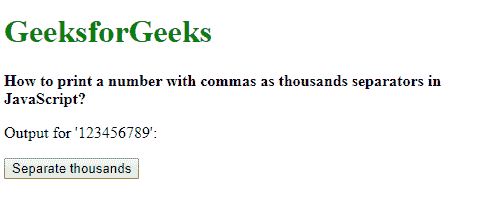
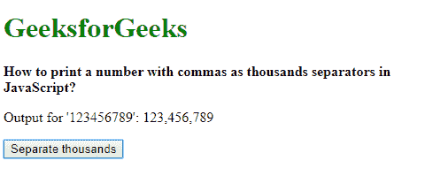
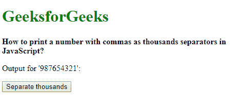

# 如何在 JavaScript 中打印一个用逗号作为千位分隔符的数字？

> 原文:[https://www . geeksforgeeks . org/如何打印带逗号的数字作为 javascript 中的千位分隔符/](https://www.geeksforgeeks.org/how-to-print-a-number-with-commas-as-thousands-separators-in-javascript/)

**方法一:使用 Intl。NumberFormat()**

*   **国际号码。NumberFormat()** 对象用于以对语言敏感的格式表示数字。根据指定的区域设置，它可用于表示货币或百分比。
*   此对象的 locales 参数用于指定数字的格式。“en-US”区域设置用于指定区域设置采用美国和英语的格式，其中数字用千位之间的逗号表示。
*   该对象的 **format()** 方法可用于返回指定区域和格式选项中的数字字符串。这将在数千个位置用逗号格式化数字，并返回一个带有格式化数字的字符串。

**语法:**

```
nfObject = new Intl.NumberFormat('en-US')
nfObject.format(givenNumber)

```

**示例:**

```
<!DOCTYPE html>
<html>

<head>
    <title>
        Print a number with commas as
      thousands separators in JavaScript.
    </title>
</head>

<body>
    <h1 style="color: green">
      GeeksforGeeks
  </h1>
    <b>
       How to print a number with commas as thousands
       separators in JavaScript?
    </b>
    <p>Output for '123456789': <span class="output"></span>
  </p>

    <button onclick="separateNumber()">Separate thousands</button>
    <script type="text/javascript">
        function separateNumber() {
            givenNumber = 123456789;

            nfObject = new Intl.NumberFormat('en-US');
            output = nfObject.format(givenNumber);

            document.querySelector('.output').textContent = output;

        }
    </script>
</body>

</html>
```

**输出:**

*   **点击按钮前:**
    
*   **点击按钮后:**
    

**方法二:使用 tolocalesting()**

*   **ToLocalString()**方法用于返回具有数字的语言敏感表示的字符串。可选的 locales 参数用于指定数字的格式。
*   区域设置“en-US”用于指定区域设置采用美国和英语的格式，其中数字用千位之间的逗号表示。这将在数千个位置用逗号格式化数字，并返回一个带有格式化数字的字符串。

**语法:**

```
givenNumber.toLocaleString('en-US')
```

**示例:**

```
<!DOCTYPE html>
<html>

<head>
    <title>
        Print a number with commas as 
      thousands separators in JavaScript.
    </title>
</head>

<body>
    <h1 style="color: green">GeeksforGeeks</h1>
    <b>
        How to print a number with commas as thousands
        separators in JavaScript?
    </b>
    <p>Output for '987654321': <span class="output"></span>
  </p>

    <button onclick="separateNumber()">
      Separate thousands
  </button>
    <script type="text/javascript">
        function separateNumber() {
            givenNumber = 987654321;

            output = givenNumber.toLocaleString('en-US');

            document.querySelector('.output').textContent = output;

        }
    </script>
</body>

</html>
```

**输出:**

*   **点击按钮前:**
    
*   **点击按钮后:**
    