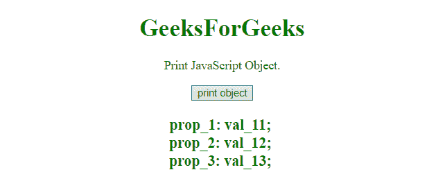
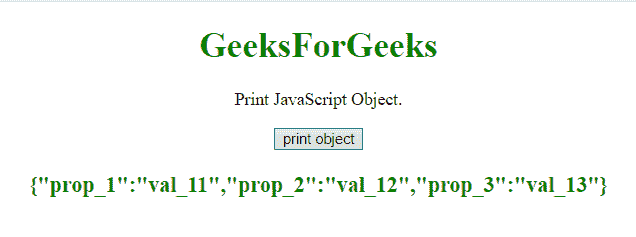

# 如何用 JavaScript 打印一个对象的内容？

> 原文:[https://www . geesforgeks . org/如何打印 javascript 对象内容/](https://www.geeksforgeeks.org/how-to-print-content-of-object-in-javascript/)

JSON.stringify()方法用于打印 JavaScript 对象。
**[JSON.stringify()方法](https://www.geeksforgeeks.org/javascript-json-stringify-with-examples/):**JSON . stringify()方法用于允许获取一个 JavaScript 对象或数组，并从中创建一个 JSON 字符串。在使用 JavaScript 开发应用程序时，需要多次将数据序列化为字符串，以便将数据存储到数据库中或将数据发送到应用编程接口或网络服务器。数据必须是字符串的形式。在 JSON.stringify()函数的帮助下，可以很容易地完成对象到字符串的转换。

**语法:**

```
JSON.stringify(value, replacer, space)
```

**示例 1:** 本示例通过简单地遍历对象并将对象属性和值附加到字符串来将对象转换为字符串。

```
<!DOCTYPE html> 
<html> 
    <head> 
        <title> 
            Print the content of object using JavaScript
        </title>
    </head> 

    <body style = "text-align:center;" id = "body"> 

        <h1 style = "color:green;" > 
            GeeksForGeeks 
        </h1>

        <p>
            Print JavaScript Object.
        </p>

        <button onclick = "gfg_Run()"> 
            print object
        </button>

        <p id = "GFG_DOWN" style 
               = "color:green; font-size: 20px; font-weight: bold;">
        </p>

        <script>
            var el_down = document.getElementById("GFG_DOWN");

            var GFG_object = { 
                prop_1: 'val_11', 
                prop_2: 'val_12', 
                prop_3: 'val_13'
            };

            var printObj = function(obj) {
                var string = '';

                for(var prop in obj) {
                    if(typeof obj[prop] == 'string') {
                        string+= prop + ': ' + obj[prop]+'; </br>';
                    }
                    else {
                        string+= prop + ': { </br>' + print(obj[prop]) + '}';
                    }
                }

                return string;
            }
            function gfg_Run() { 
                el_down.innerHTML = printObj(GFG_object);
            }
        </script> 
    </body> 
</html>                    
```

**输出:**

*   **点击按钮前:**
    
*   **点击按钮后:**
    

**示例 2:** 本示例使用 **JSON.stringify()** 方法将对象转换为字符串。

```
<!DOCTYPE html> 
<html> 
    <head> 
        <title> 
            JavaScript | Print content of object
        </title>
    </head> 

    <body style = "text-align:center;" id = "body"> 

        <h1 style = "color:green;" > 
            GeeksForGeeks 
        </h1>

        <p>
            Print JavaScript Object.
        </p>

        <button onclick = "gfg_Run()"> 
            print object
        </button>

        <p id = "GFG_DOWN" style 
                = "color:green; font-size: 20px; font-weight: bold;">
        </p>

        <script>
            var el_down = document.getElementById("GFG_DOWN");

            var GFG_object = {
                prop_1: 'val_11',
                prop_2: 'val_12', 
                prop_3: 'val_13'
            };

            function gfg_Run() { 
                el_down.innerHTML = JSON.stringify(GFG_object);
            }

        </script> 
    </body> 
</html>                    
```

**输出:**

*   **点击按钮前:**
    
*   **点击按钮后:**
    